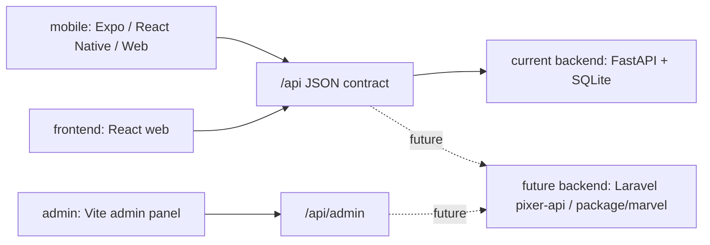
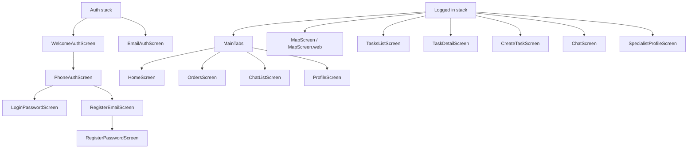
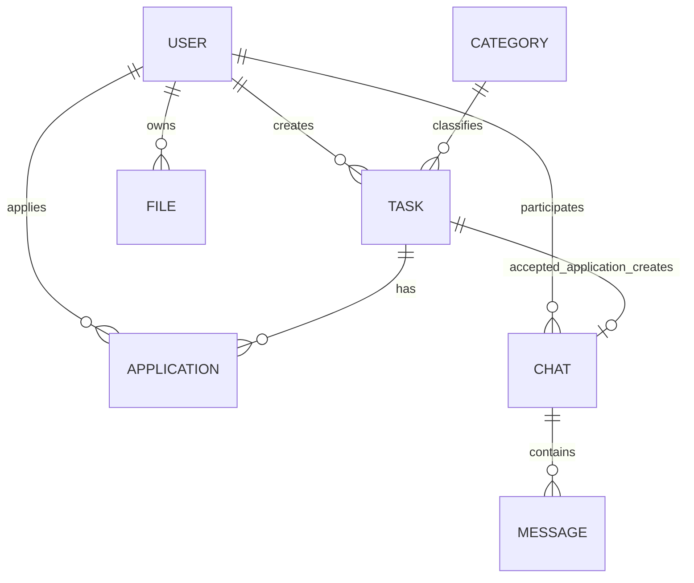
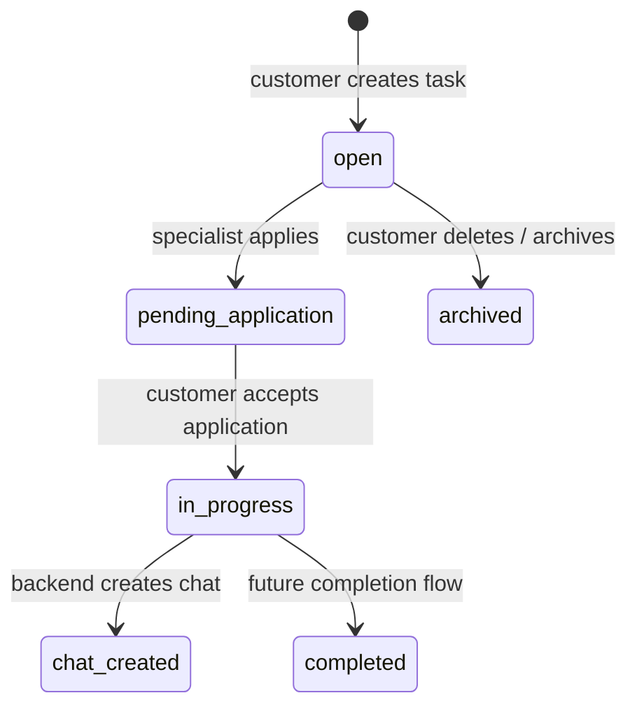
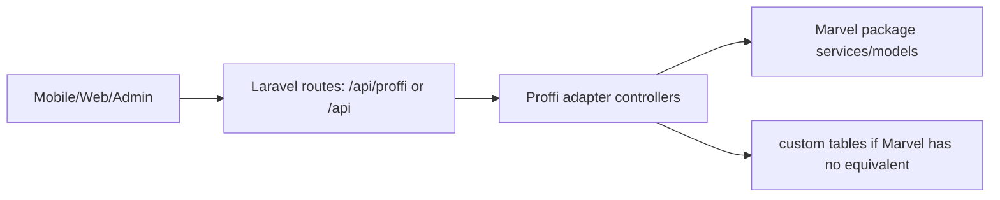

# Proffi App Map

Документ фиксирует текущую структуру приложения Proffi и API-контракт, который нужно будет посадить на Laravel/Pixer API (`package/marvel`). Цель: быстро видеть, какие экраны, сущности и функции уже есть в клиенте, а какие Laravel-контроллеры/адаптеры понадобятся.

## Общая Схема

Текущее приложение состоит из четырех рабочих частей:

- `mobile/` - основное мобильное приложение на Expo. Сейчас также запускается в браузере через `npm run start:web --prefix mobile`.
- `frontend/` - web-клиент marketplace на React.
- `admin/` - простая админка для пользователей, категорий, фильтров и seed.
- `backend/` - текущий FastAPI backend, который надо заменить или совместить с Laravel API.

## Запуск Сейчас

- Mobile native / Expo Go: `npm run start --prefix mobile`
- Mobile web preview: `npm run start:web --prefix mobile`, URL `http://127.0.0.1:8082`
- Frontend build: `npm run build --prefix frontend`
- Admin build: `npm run build --prefix admin`
- Текущий API base для mobile: `EXPO_PUBLIC_API_URL`, по умолчанию `http://127.0.0.1:8001`
- Текущий API base для frontend: `REACT_APP_API_URL` или host с портом `8001`
- Admin API base: `VITE_API_BASE` или текущий host

## Клиентские Поверхности

### Mobile

Навигация:

Основные mobile-модули:

- `mobile/src/api.ts` - единая обертка `apiFetch`, токен, upload, `fileUrl`.
- `mobile/src/context/AuthContext.tsx` - текущий пользователь, `refreshMe`, `signIn`, `logout`.
- `mobile/src/navigation/RootNavigator.tsx` - auth/app роутинг и bottom tabs.
- `mobile/src/services/chatApiService.ts` - API-реализация чатов.
- `mobile/src/services/chatService.ts` - native hybrid: API, fallback на SQLite demo-чаты.
- `mobile/src/services/chatService.web.ts` - web hybrid: API, fallback на in-memory demo-чаты.
- `mobile/src/db/database.ts` - локальная SQLite demo-база чатов для native.
- `mobile/src/i18n.ts` - русские тексты интерфейса.
- `mobile/src/mocks/demoData.ts` - demo-заказы/специалист, если API недоступен.

Mobile web-адаптеры:

- `KeyboardRoot.web.tsx`, `KeyboardViews.web.tsx` - обход `react-native-keyboard-controller`.
- `DatabaseProvider.web.tsx` - не инициализирует SQLite в браузере.
- `MapScreen.web.tsx` - web-заглушка карты без `react-native-maps`.

### Frontend

Роуты в `frontend/src/App.js`:

- `/` onboarding/home flow
- `/home`
- `/tasks`
- `/tasks/:id`
- `/create-task`
- `/orders`
- `/map`
- `/chats`
- `/chats/:id`
- `/profile`
- `/specialists/:id`
- `/login`
- `/register`

Ключевые модули:

- `frontend/src/api.js` - axios base `/api`, Bearer token из `localStorage.token`.
- `frontend/src/auth.jsx` - login/register/current user.
- `frontend/src/pages/*` - страницы marketplace.
- `frontend/src/components/Layout.jsx` - нижняя/основная навигация.

### Admin

Админка использует `X-Admin-Token`.

Страницы:

- `Dashboard.jsx` - статистика.
- `Users.jsx` - CRUD пользователей.
- `Categories.jsx` - CRUD категорий.
- `Filters.jsx` - CRUD фильтров.
- `Login.jsx` - ввод admin token.

## Основные Сущности

### User

Поля, которые ожидают клиенты:

- `id`
- `phone`
- `name`
- `role`: `customer | specialist | admin`
- `city`
- `rating`
- `reviews_count`
- `bio`
- `services`: массив строк
- `avatar`
- `lat`, `lng`
- `last_seen`
- `created_at`
- `email`
- `is_verified`

### Task / Order

- `id`
- `title`
- `description`
- `category`
- `city`
- `address`
- `budget`
- `deadline`
- `status`: `open | in_progress | completed | archived` в текущей логике
- `customer_id`
- `customer_name`
- `applications_count`
- `accepted_specialist_id`
- `lat`, `lng`
- `photos`: массив file paths
- `distance_km`
- `created_at`

### Application / Offer

- `id`
- `task_id`
- `task_title`
- `specialist_id`
- `specialist_name`
- `specialist_rating`
- `specialist_city`
- `message`
- `price`
- `status`: `pending | accepted | rejected`
- `created_at`

### Chat

- `id`
- `task_id`
- `task_title`
- `customer_id`
- `customer_name`
- `specialist_id`
- `specialist_name`
- `last_message`
- `last_message_at`
- `task_status`
- `created_at`

### Message

- `id`
- `chat_id`
- `sender_id`
- `sender_name`
- `text`
- `created_at`

Mobile adapter maps backend messages to:

- `user_id = sender_id`
- `type = "text"` by default

### Category

- `id`
- `icon`
- `name_ru`
- `name_ro`

### File

- upload response: `{ path: string }`
- public URL is expected as `/api/files/{path}`

## Required API Contract For Laravel

Все клиентские приложения сейчас ожидают prefix `/api`, кроме admin, который ходит на `/api/admin`.

### Auth

| Method | Path | Auth | Used by | Notes |
|---|---|---:|---|---|
| POST | `/api/auth/check-phone` | no | mobile | body `{ phone }`, response `{ registered: boolean }` |
| POST | `/api/auth/register-phone` | no | mobile, frontend | body `{ phone, password, name, role, city?, email? }`, response `{ token, user }` |
| POST | `/api/auth/register` | no | mobile email auth | body `{ email, role, name? }`, response `{ status: "otp_sent", email }` |
| POST | `/api/auth/login` | no | mobile, frontend | phone+password OR email OTP-start; response `{ token, user }` or `{ status: "otp_sent", email }` |
| POST | `/api/auth/verify` | no | mobile email auth | body `{ email, otp_code }`, response `{ token, user }` |
| GET | `/api/auth/me` | Bearer | all clients | current user |
| GET | `/api/auth/stats` | Bearer | profile | role-specific stats |
| PATCH | `/api/auth/profile` | Bearer | profile | update `bio`, `services`, `avatar`, etc. |
| POST | `/api/auth/logout` | Bearer | optional | current backend has it |

Laravel note: если Pixer уже использует Sanctum/Passport/JWT, проще сделать adapter endpoints, которые возвращают текущий формат `{ token, user }`, не переписывая клиентов сначала.

### Categories / Stories

| Method | Path | Auth | Notes |
|---|---|---:|---|
| GET | `/api/categories` | optional/no | list categories in Russian format |
| GET | `/api/stories` | optional/no | mobile/web story cards; можно временно вернуть статический массив |

### Tasks / Orders

| Method | Path | Auth | Notes |
|---|---|---:|---|
| GET | `/api/tasks` | optional/no | filters: `category`, `q`, `city`, `lat`, `lng`, `sort=distance` |
| POST | `/api/tasks` | Bearer | create customer task |
| GET | `/api/tasks/mine` | Bearer | customer orders |
| GET | `/api/applications/mine` | Bearer | specialist orders/offers |
| GET | `/api/tasks/{task_id}` | optional/Bearer | task detail |
| DELETE | `/api/tasks/{task_id}` | Bearer | owner delete |
| POST | `/api/tasks/{task_id}/applications` | Bearer specialist | create offer |
| GET | `/api/tasks/{task_id}/applications` | Bearer customer | list offers |
| POST | `/api/applications/{app_id}/accept` | Bearer customer | accept offer, creates/returns chat |
| GET | `/api/tasks/{task_id}/specialist-info` | Bearer | accepted specialist summary |

Important lifecycle:

### Chats

| Method | Path | Auth | Notes |
|---|---|---:|---|
| GET | `/api/chats` | Bearer | optional query `status=open|in_progress|completed|archived` |
| GET | `/api/chats/{chat_id}` | Bearer | only participant |
| GET | `/api/chats/{chat_id}/messages` | Bearer | ordered ascending |
| POST | `/api/chats/{chat_id}/messages` | Bearer | body `{ text }`, update chat last message |

Chat is expected to exist after customer accepts specialist application.

### Specialists

| Method | Path | Auth | Notes |
|---|---|---:|---|
| GET | `/api/specialists` | optional/no | query `city?` |
| GET | `/api/specialists/{user_id}` | optional/no | public specialist profile |

### Uploads / Files

| Method | Path | Auth | Notes |
|---|---|---:|---|
| POST | `/api/uploads` | Bearer | multipart `file`, response `{ path }` |
| GET | `/api/files/{path}` | no | stream public file |

### Admin

Uses header `X-Admin-Token`.

| Method | Path |
|---|---|
| GET | `/api/admin/stats` |
| GET | `/api/admin/users` |
| POST | `/api/admin/users` |
| DELETE | `/api/admin/users/{user_id}` |
| GET | `/api/admin/categories` |
| POST | `/api/admin/categories` |
| DELETE | `/api/admin/categories/{category_id}` |
| GET | `/api/admin/filters` |
| POST | `/api/admin/filters` |
| PUT | `/api/admin/filters/{filter_id}` |
| DELETE | `/api/admin/filters/{filter_id}` |
| POST | `/api/admin/seed` |

## What To Search In Pixer API / Marvel

После копирования Laravel проекта нужно искать в `pixer-api/package/marvel`:

- auth guards/controllers: login, register, me/profile, token issue
- users/customers/vendors/shops/sellers models, чтобы сопоставить `customer` и `specialist`
- products/orders/offers/questions/conversations/messages modules
- categories/tags/types mapping
- uploads/media storage endpoints
- marketplace order lifecycle, если уже есть booking/order/request entities
- admin controllers/routes for users/categories/settings

Ожидаемые вероятные маппинги:

| Proffi | Pixer/Marvel candidate |
|---|---|
| Task/order request | order, product request, service request, question, custom model may be needed |
| Application/offer | offer/proposal/vendor response; likely custom table/controller needed |
| Specialist | vendor/shop owner/user with role |
| Customer | customer/user |
| Chat/message | conversations/messages if present; otherwise custom |
| Category | categories/types/tags |
| File | attachments/uploads/media |

## Laravel Adapter Strategy

Рекомендуемый путь - не переписывать mobile/frontend сразу, а сделать Laravel adapter layer с теми же URL/JSON:

Практически:

1. Поднять Laravel локально и убедиться, что база/миграции работают.
2. Найти существующие Marvel endpoints и модели.
3. Составить mapping table: Proffi endpoint -> existing Marvel endpoint/model -> missing/custom.
4. Реализовать недостающие Laravel routes под текущий клиентский контракт.
5. Переключить `.env` клиентов на Laravel base URL.
6. Проверить flows:
   - регистрация/логин
   - создание заказа
   - список/карта заказов
   - отклик специалиста
   - принятие отклика
   - чат и сообщения
   - профиль/аватар
   - админка

## Current Known Gaps / Risks

- Mobile в dev по умолчанию может пропускать auth через `EXPO_PUBLIC_SKIP_AUTH`; при Laravel-интеграции надо поставить `EXPO_PUBLIC_SKIP_AUTH=0` для реальной проверки.
- Web-preview mobile использует адаптеры и не является 1:1 native по карте/SQLite.
- Текущий FastAPI контракт достаточно простой; Pixer/Marvel, вероятно, имеет другую модель данных. Нужен adapter, иначе придется массово менять клиентов.
- Email OTP сейчас реализован в FastAPI; в Laravel можно заменить на существующую mail/OTP систему или временный dev-code.
- Чаты завязаны на принятие отклика. Если в Pixer нет такой сущности, надо создать `applications/offers` и `chats/messages`.
- Категории ожидают `name_ru/name_ro`; Pixer может иметь `name`, `slug`, translations.

## Next Step After Copying Pixer API

Когда папка Laravel будет скопирована, проверить наличие:

- `pixer-api/artisan`
- `pixer-api/composer.json`
- `pixer-api/.env` или `.env.example`
- `pixer-api/package/marvel`
- `pixer-api/routes/api.php`
- `pixer-api/package/marvel/src/...`

Затем выполнить:

1. Просканировать routes/controllers/models/migrations Marvel.
2. Составить `PROFFI_LARAVEL_MAPPING.md`.
3. Поднять Laravel локально.
4. Написать adapter endpoints.
5. Переключить clients на Laravel и проверить через `mobile` web-preview.
