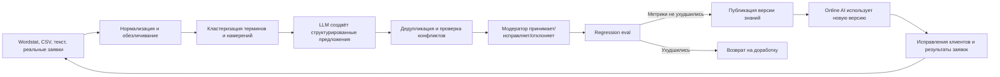
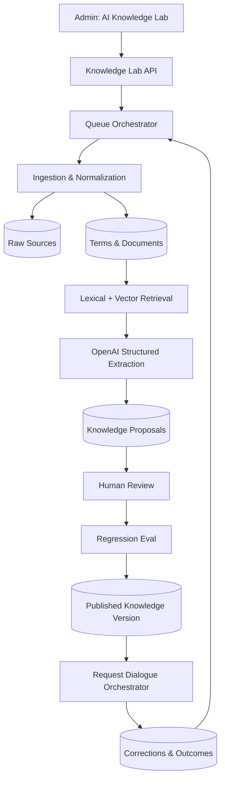

# Treabo AI Knowledge Lab

## Самообучающееся доменное ядро услуг, терминов и обучающих данных

Статус: проект ТЗ для согласования  
Версия: 1.0  
Дата: 30 июля 2026  
Связанный документ: `docs/AI_REQUEST_ASSISTANT_TZ.md`  
Область: `pixer-api`, `admin`, фоновые задачи; интеграция с диалогом заявок  
Ограничение этапа: проектирование, без изменения прикладного кода до согласования.

## 1. Краткое решение

Treabo не требуется обучать собственную большую языковую модель с нуля. Это потребовало бы огромного корпуса, GPU-инфраструктуры и отдельной ML-команды, но не решило бы главную задачу — поддерживать точный, управляемый каталог услуг.

Treabo требуется собственное **доменное AI-ядро**, состоящее из:

1. версионируемой онтологии услуг;
2. словаря пользовательских терминов, синонимов, ошибок и коммерческих ключей;
3. базы примеров реальных запросов и правильной классификации;
4. конвейера импорта Wordstat/CSV/текста;
5. LLM-лаборатории, которая превращает сырой материал в предложения;
6. модерации и безопасной публикации;
7. retrieval-слоя, который передаёт online AI только релевантный фрагмент знаний;
8. цикла обратной связи по реальным заявкам;
9. eval-набора и метрик;
10. опционального fine-tuning после накопления достаточного числа подтверждённых примеров.

Это и будет «ядром ИИ» Treabo: данные и правила принадлежат Treabo, OpenAI используется как обработчик, teacher и inference-модель. Поставщика модели можно заменить без потери накопленного знания.

## 2. Что означает «самообучение»

### 2.1. Безопасное определение

Самообучение в Treabo — автоматический сбор сигналов, группировка, построение предложений и оценка их полезности. Production-каталог и поведение AI изменяются только после проверки и публикации версии.



### 2.2. Что нельзя делать автоматически

- создавать и публиковать новую работу по одному ключевому слову;
- добавлять любой пользовательский текст в system prompt;
- считать выбор AI истинной меткой для следующего обучения;
- перезаписывать категорию или работу без аудита;
- обучаться на телефонах, адресах, ФИО и переписке без обезличивания;
- смешивать рекламный спрос Wordstat с реальным перечнем выполняемых услуг;
- запускать fine-tuning на непроверенных примерах;
- позволять новой версии ухудшать regression metrics.

### 2.3. Уровни зрелости

| Уровень | Что обучается | Как используется |
|---|---|---|
| L0 | Ручной каталог и инструкции | Текущая система |
| L1 | Словарь терминов и aliases | Дешёвый поиск кандидатов без LLM |
| L2 | Подтверждённые примеры запрос → работа | Retrieval, few-shot, eval |
| L3 | Автоматические предложения из потоков данных | Human-in-the-loop публикация |
| L4 | Ранжировщик/классификатор на собственных данных | Сокращает LLM-вызовы |
| L5 | Fine-tuned модель | Только после доказанной экономической пользы |

MVP Knowledge Lab должен довести Treabo до L2–L3.

## 3. Аудит текущей базы знаний

### 3.1. Что уже есть

Таблица `ai_chat_knowledge`:

- типы `category`, `work`, `parameter`, `question`, `instruction`;
- `category_slug`, `work_slug`, `title`, `slug`, `content`, произвольный `payload`;
- порядок и флаг активности;
- CRUD endpoint `/proffi/admin/ai-chat/knowledge`;
- административный экран «AI инструкции Treabo».

### 3.2. Фактическое использование

`JobDraftAiService` выбирает только активные строки типа `instruction` и добавляет их в system prompt. Записи `category`, `work`, `parameter`, `question` не участвуют в online-классификации. В админке создание нового объекта фактически ограничено типом `instruction`.

Следовательно, текущая сущность называется базой знаний, но является хранилищем неструктурированных prompt-инструкций.

### 3.3. Чего не хватает

- источника и происхождения знания;
- статусов draft/review/published/rejected;
- confidence и evidence;
- нормализованных терминов;
- связей термин → категория/работа/материал/проблема;
- частотности, региона и периода Wordstat;
- импорта файлов и больших текстовых списков;
- batch-processing;
- кластеров;
- предложений на изменение каталога;
- сравнения с существующими объектами;
- модерации;
- versioning;
- embedding/vector index;
- обучающих примеров;
- negative examples;
- eval;
- feedback loop;
- расчёта стоимости лаборатории.

## 4. Основные понятия

### 4.1. Онтология

Структурированное описание предметной области:

- категория;
- работа;
- действие: ремонт, монтаж, замена, диагностика, демонтаж;
- объект: унитаз, бачок, кран, розетка;
- проблема: протечка, засор, искрение;
- материал: плитка, керамогранит, медь;
- инструмент/оборудование;
- параметр и единица измерения;
- вопрос;
- вариант ответа;
- условное правило;
- safety term;
- ограничение и пожелание.

### 4.2. Термин

Фраза, которую может использовать клиент:

- нормативное название;
- разговорный синоним;
- словоформа;
- опечатка;
- транслитерация;
- регионализм;
- профессиональный термин;
- рекламный/поисковый запрос;
- negative term.

Термин не равен работе. Например, «бачок» — объект, «течёт бачок» — проблема + объект, «замена бачка» — возможная работа.

### 4.3. Обучающий пример

Обезличенный текст с подтверждёнными метками:

```json
{
  "text": "подтекает бачек вода перекрывается",
  "input_class": "service_request",
  "category_id": "plumbing",
  "service_id": 142,
  "facts": {
    "fixture": "toilet",
    "fault_type": "leak",
    "water_shutoff_possible": true
  },
  "label_source": "customer_confirmed",
  "quality": "gold"
}
```

### 4.4. Предложение

Результат лаборатории, который ещё не является production-знанием:

- добавить alias;
- создать или объединить термин;
- привязать термин к существующей работе;
- предложить новую работу;
- предложить объект/проблему/материал;
- предложить вопрос или option;
- предложить условное правило;
- добавить negative example;
- пометить кластер как нерелевантный;
- объединить дубли.

## 5. Рекомендуемая архитектура

### 5.1. Варианты

#### Вариант A — только prompt и таблица инструкций

Простой, но быстро становится противоречивым, дорогим и непроверяемым. Не рекомендуется.

#### Вариант B — собственная LLM с нуля

Не соответствует масштабу задачи. Требует больших данных, GPU и постоянной ML-эксплуатации. Не рекомендуется.

#### Вариант C — доменное ядро + OpenAI + retrieval + feedback

Рекомендуется. Собственные данные, онтология, примеры и eval хранятся в Treabo. OpenAI выполняет сложное понимание и генерацию структурированных предложений. Простые операции выполняются локально.

#### Вариант D — немедленный fine-tuning

Преждевременно: нет достаточного числа качественных меток и eval baseline. Рассматривать после L3.

### 5.2. Размещение

На первом этапе не нужен отдельный микросервис или отдельный публичный API.

Рекомендуемая структура:

```text
pixer-api/
  app/
    Domain/AiKnowledge/
      Import/
      Normalize/
      Cluster/
      Propose/
      Review/
      Publish/
      Retrieval/
      Feedback/
      Evaluation/
    Jobs/AiKnowledge/
    Http/Controllers/Proffi/AiKnowledgeLab/
    Models/AiKnowledge/
  config/ai_knowledge.php
  database/migrations/
```

Это логическая папка Laravel-кода, а не место хранения «модели». Модель вызывается через OpenAI API. Данные хранятся в БД и объектном storage.

### 5.3. Когда выделять отдельный сервис

Выделить `ai-knowledge-worker` на Python только если появится хотя бы одно условие:

- более 1 млн терминов/примеров;
- локальные embedding-модели;
- сложная ML-кластеризация и обучение классификатора;
- GPU inference;
- нагрузка batch-задач мешает API;
- отдельная ML-команда и независимый release cycle.

До этого достаточно Laravel queues + Redis + PostgreSQL/pgvector либо текущей БД с отдельным vector store.

### 5.4. Нужен ли готовый AI-фреймворк

Для MVP не нужен LangChain/LlamaIndex как обязательное ядро. Бизнес-логика pipeline должна оставаться явной и тестируемой:

- native HTTP/OpenAI SDK;
- Structured Outputs;
- Laravel jobs/queues;
- собственные state/status таблицы;
- PostgreSQL full-text/trigram и pgvector при доступности;
- S3-compatible storage для исходных файлов.

Фреймворк можно подключить позже для конкретной функции, но он не должен владеть каталогом, версиями или публикацией.

## 6. Компоненты ядра



### 6.1. Ingestion

Принимает:

- вставленный текст;
- CSV/XLSX;
- Wordstat export;
- JSONL;
- список существующих категорий/работ;
- обезличенные пользовательские запросы;
- исправления операторов;
- результаты поиска по сайту;
- впоследствии — партнёрские прайс-листы.

### 6.2. Normalizer

Без LLM:

- UTF-8, lowercase для search form;
- удаление лишних пробелов;
- `ё/е` search-normalization с сохранением display;
- выделение частотности и региона;
- удаление UTM/URL и мусора;
- точные дубли;
- PII redaction;
- language detection;
- stemming/lemmatization как дополнительное поле, не замена оригинала.

### 6.3. Candidate generator

Сначала дешёвые методы:

- exact aliases;
- полнотекстовый поиск;
- trigram/fuzzy;
- token overlap;
- embedding similarity;
- текущая популярность работ.

Результат — top 5–20 существующих объектов. Только затем LLM принимает решение или предлагает новое.

### 6.4. LLM Extractor

Обрабатывает кластер, а не каждое ключевое слово по отдельности. Возвращает строгий JSON:

- общее намерение;
- head term;
- action/object/problem/material;
- существующие кандидаты;
- решение `map|new|ambiguous|irrelevant`;
- предложения;
- вопросы к администратору;
- evidence;
- confidence.

### 6.5. Proposal Engine

Проверяет:

- дубли;
- конфликт с negative aliases;
- размер кластера и суммарную частотность;
- наличие нескольких разных intent;
- ссылки на существующие ID;
- совместимость типов;
- достаточно ли evidence.

### 6.6. Review

Администратор подтверждает, исправляет, объединяет или отклоняет предложения. Решения модератора становятся новыми gold labels для будущих runs.

### 6.7. Publisher

Создаёт immutable knowledge/catalog version, запускает eval, строит индексы и только затем делает версию доступной online-диалогу.

### 6.8. Feedback Collector

Собирает только полезные сигналы:

- пользователь подтвердил AI-категорию/работу;
- пользователь исправил категорию/работу;
- оператор изменил заявку;
- мастер отметил неверную работу;
- заявка завершена/брошена;
- ответ на вопрос подтверждён;
- ручной fallback;
- zero-result search.

## 7. Импорт Wordstat

### 7.1. Важное ограничение

Wordstat показывает поисковый спрос, а не правильную структуру каталога. Запросы могут содержать:

- информационные намерения: «как починить кран самому»;
- товары: «купить унитаз»;
- вакансии и обучение;
- бренды;
- географические хвосты;
- цены;
- конкурентов;
- нерелевантный омонимичный смысл.

Поэтому Wordstat — источник терминов и спроса, не источник истины.

### 7.2. Поддерживаемый формат

Минимальные колонки:

- `phrase`;
- `frequency`;
- `region`;
- `period`.

Опционально:

- `source_campaign`;
- `device`;
- `operator`;
- `parent_phrase`;
- `notes`.

### 7.3. Pipeline

1. загрузка или вставка;
2. preview колонок и encoding;
3. normalization;
4. фильтрация точных дублей;
5. cheap classification: commercial/informational/product/job/irrelevant;
6. lexical + embedding clustering;
7. выбор репрезентативных фраз каждого кластера;
8. один LLM batch на кластер;
9. proposal generation;
10. review queue;
11. eval;
12. publish.

### 7.4. Критерии новой работы

Лаборатория может предложить новую работу, если:

- кластер не соответствует существующей работе;
- минимум N уникальных фраз;
- суммарная частотность выше настраиваемого порога;
- intent является заказом услуги;
- работа достаточно конкретна для назначения мастера;
- нет только регионального/ценового различия;
- proposal подтверждён человеком.

Начальные пороги: 10 уникальных фраз или частотность 100/месяц. Они настраиваются, а не зашиваются в prompt.

### 7.5. Вопросы, которые LLM задаёт администратору

Если данных недостаточно, run создаёт clarification card:

- «Это отдельная работа или синоним “Ремонт унитаза”?»
- «“Установка инсталляции” относится к сантехнике или ремонту ванной как primary category?»
- «Нужно ли мастеру знать, куплена ли инсталляция?»
- «Варианты “бачок / слив / крепление / протечка” взаимоисключающие?»

Ответ администратора обновляет proposal, а не system prompt напрямую.

## 8. Обучение через текстовое поле

### 8.1. Режим «Быстро научить»

Одно большое поле:

> Вставьте список ключевых фраз, описание направления, прайс-лист или заметки специалиста.

Дополнительные параметры:

- источник;
- предполагаемая категория;
- регион;
- период;
- режим: `термины|каталог|вопросы|полный анализ`;
- уровень автоматизации;
- лимит стоимости.

### 8.2. Диалог обучения

1. система показывает, что распознано;
2. группирует материал по предполагаемым услугам;
3. задаёт администратору один вопрос за ход;
4. формирует proposal pack;
5. показывает diff:
   - добавить 34 aliases;
   - создать 2 работы;
   - добавить 6 объектов;
   - добавить 4 вопроса;
   - 18 фраз признать информационными;
6. администратор принимает элементы выборочно;
7. запускается тест;
8. версия публикуется.

### 8.3. Пример

Ввод:

```text
течет бачок
подтекает унитаз снизу
ремонт слива унитаза
замена арматуры бачка
не набирается вода в бачок
сколько стоит поменять унитаз
как починить унитаз самому
```

Предлагаемый результат:

- существующая/новая работа: «Ремонт унитаза»;
- objects: `toilet`, `cistern`, `flush_mechanism`;
- problems: `leak`, `no_water_intake`, `flush_failure`;
- actions: `repair`, `replace`;
- aliases и опечатки;
- информационная negative phrase: `как ... самому`;
- вопросы: источник протечки, часть унитаза, возможность перекрыть воду;
- отдельная работа «Замена унитаза» только если каталог и intent это подтверждают.

## 9. Самообучение на заявках

### 9.1. События

Каждая заявка создаёт `learning_event`, но не обучает production автоматически.

Типы:

- `classification_confirmed`;
- `classification_corrected`;
- `service_manually_selected`;
- `answer_corrected`;
- `question_skipped`;
- `manual_fallback`;
- `master_reclassified`;
- `task_completed`;
- `task_cancelled`;
- `unrecognized_text`;
- `multi_intent_split`;
- `search_no_results`.

### 9.2. Качество меток

| Источник | Вес | Качество |
|---|---:|---|
| Модератор каталога | 1.0 | gold |
| Подтверждённое исправление клиента | 0.9 | gold/silver |
| Исправление оператора | 0.9 | gold |
| Подтверждение клиента без исправления | 0.7 | silver |
| Мастер выбрал специализацию | 0.6 | silver |
| Только ответ AI | 0.0 | unlabeled |
| Незавершённая заявка | 0.1 | diagnostic |

AI prediction не может быть собственным ground truth.

### 9.3. Nightly/weekly jobs

Ночью:

- PII redaction;
- дубли;
- embedding новых уникальных текстов;
- поиск неизвестных кластеров;
- confusion pairs;
- cost anomalies.

Еженедельно:

- proposals по кластерам;
- обновление dataset draft;
- regression eval;
- отчёт редактору.

### 9.4. Автоматическое принятие

На ранних этапах запрещено. После накопления статистики можно auto-accept только низкорисковые изменения:

- новая опечатка/словоформа для существующего термина;
- подтверждена минимум 30 независимыми событиями;
- precision на holdout ≥99%;
- нет конфликта с другой работой;
- изменение обратимо и журналируется.

Новые категории, работы, вопросы, правила и safety-знания всегда требуют человека.

## 10. Модель данных

### 10.1. Источники и импорты

#### `knowledge_sources`

- `id`, `name`
- `type`: `manual_text|wordstat|csv|xlsx|requests|operator|master|external`
- `description`
- `default_region`
- `trust_level`
- `created_by`
- timestamps

#### `knowledge_imports`

- `id`, `source_id`
- `file_path`, `original_filename`
- `status`: `uploaded|parsing|normalizing|clustering|analyzing|review|completed|failed|cancelled`
- `mode`
- `settings_json`
- row counters
- token/cost budget and actual cost
- `error_json`
- timestamps

#### `knowledge_source_rows`

- `id`, `import_id`, `row_no`
- `raw_text`
- `normalized_text`
- `frequency`, `region`, `period`
- `language`
- `pii_redacted_text`
- `content_hash`
- `status`
- `metadata_json`

### 10.2. Термины

#### `knowledge_terms`

- `id`, `stable_key`
- `display_text`, `normalized_text`
- `term_type`: `service|action|object|problem|material|parameter|brand|informational|negative|unknown`
- `language`, `region`
- `status`: `draft|published|archived`
- `first_seen_at`, `last_seen_at`
- aggregate frequency/use count
- `created_from_proposal_id`
- timestamps

#### `knowledge_term_variants`

- `term_id`
- `variant_text`, `normalized_text`
- `variant_type`: `synonym|misspelling|wordform|translit|professional|colloquial|search_phrase`
- frequency, confidence
- source/evidence

#### `knowledge_term_links`

- `term_id`
- `target_type`: `category|service|question|option|material|safety_rule`
- `target_id`
- `relation`: `alias_of|indicates|excludes|requires_context|part_of|problem_of|material_for`
- weight
- status/version

### 10.3. Документы и embeddings

#### `knowledge_documents`

- `id`
- `document_type`: `catalog_entity|term_cluster|training_example|instruction|expert_note`
- `entity_type`, `entity_id`
- `content`
- `content_hash`
- `knowledge_version_id`
- metadata

#### `knowledge_embeddings`

- `document_id`
- `provider`, `model`, `dimensions`
- `embedding` vector либо external vector ID
- `content_hash`
- timestamps

Embedding перестраивается только при изменении content hash или модели.

### 10.4. Кластеры

#### `knowledge_clusters`

- `id`, `import_id`
- `label`
- `centroid`
- row count, total frequency
- `status`
- proposed intent/entity IDs
- quality metrics

#### `knowledge_cluster_rows`

- `cluster_id`, `source_row_id`
- similarity
- is_representative

### 10.5. Предложения

#### `knowledge_proposals`

- `id`, `import_id`, `cluster_id`
- `proposal_type`
- `status`: `generated|needs_clarification|in_review|accepted|rejected|superseded|published`
- `target_type`, `target_id`
- `payload_json`
- `evidence_json`
- confidence, risk level
- generated model/prompt version
- reviewer, review note
- timestamps

#### `knowledge_proposal_questions`

- `proposal_id`
- `question`
- `answer_type`, `options_json`
- `answer_json`
- answered_by/at

### 10.6. Training и eval

#### `ai_training_examples`

- `id`
- `input_text_redacted`
- `expected_json`
- label source, quality, weight
- catalog/knowledge version
- split: `train|validation|test|quarantine`
- content hash
- consent/retention fields
- timestamps

#### `ai_learning_events`

- `id`, `request_draft_id`, `task_id`
- `event_type`
- before/after JSON
- redacted evidence
- source actor
- weight
- processing status
- timestamps

#### `ai_evaluation_runs`

- version/model/prompt/dataset IDs
- metrics before/after
- cost/tokens/latency
- status, report path
- timestamps

### 10.7. Версии

#### `knowledge_versions`

- `id`, `version`
- `based_on_version_id`
- `status`: `draft|testing|published|archived`
- checksums: terms/documents/index
- eval run
- published by/at
- rollback metadata

## 11. Structured Output лаборатории

### 11.1. Анализ кластера

```json
{
  "type": "object",
  "additionalProperties": false,
  "required": [
    "cluster_label",
    "intent_type",
    "existing_matches",
    "entities",
    "proposals",
    "admin_questions",
    "irrelevant_phrases",
    "confidence"
  ],
  "properties": {
    "cluster_label": {"type": "string"},
    "intent_type": {
      "type": "string",
      "enum": ["service_order", "informational", "product", "job", "mixed", "irrelevant"]
    },
    "existing_matches": {
      "type": "array",
      "items": {
        "type": "object",
        "additionalProperties": false,
        "required": ["entity_type", "entity_id", "relation", "confidence"],
        "properties": {
          "entity_type": {"type": "string", "enum": ["category", "service", "question", "term"]},
          "entity_id": {"type": ["string", "integer"]},
          "relation": {"type": "string", "enum": ["same", "alias", "broader", "narrower", "related", "conflict"]},
          "confidence": {"type": "number", "minimum": 0, "maximum": 1}
        }
      }
    },
    "entities": {
      "type": "array",
      "items": {
        "type": "object",
        "additionalProperties": false,
        "required": ["entity_type", "canonical_name", "variants", "evidence"],
        "properties": {
          "entity_type": {"type": "string", "enum": ["action", "object", "problem", "material", "parameter", "brand"]},
          "canonical_name": {"type": "string"},
          "variants": {"type": "array", "items": {"type": "string"}},
          "evidence": {"type": "array", "items": {"type": "string"}}
        }
      }
    },
    "proposals": {
      "type": "array",
      "items": {
        "type": "object",
        "additionalProperties": false,
        "required": ["proposal_type", "target_id", "payload", "reason", "confidence"],
        "properties": {
          "proposal_type": {
            "type": "string",
            "enum": [
              "add_alias",
              "add_negative_alias",
              "create_term",
              "link_term",
              "create_service",
              "create_question",
              "create_option",
              "create_rule",
              "merge_entities",
              "mark_irrelevant"
            ]
          },
          "target_id": {"type": ["string", "integer", "null"]},
          "payload": {"type": "object"},
          "reason": {"type": "string"},
          "confidence": {"type": "number", "minimum": 0, "maximum": 1}
        }
      }
    },
    "admin_questions": {
      "type": "array",
      "items": {
        "type": "object",
        "additionalProperties": false,
        "required": ["question", "answer_type", "options"],
        "properties": {
          "question": {"type": "string"},
          "answer_type": {"type": "string", "enum": ["boolean", "single_select", "text"]},
          "options": {"type": "array", "items": {"type": "string"}}
        }
      }
    },
    "irrelevant_phrases": {"type": "array", "items": {"type": "string"}},
    "confidence": {"type": "number", "minimum": 0, "maximum": 1}
  }
}
```

Production schema дополнительно ограничивает `payload` через discriminated union по `proposal_type`.

## 12. API лаборатории

Все endpoint защищены admin auth, RBAC, CSRF и audit log.

### 12.1. Импорт

- `POST /proffi/admin/ai-lab/imports`
- `POST /proffi/admin/ai-lab/imports/{id}/file`
- `POST /proffi/admin/ai-lab/imports/{id}/analyze`
- `GET /proffi/admin/ai-lab/imports/{id}`
- `POST /proffi/admin/ai-lab/imports/{id}/cancel`

Создание из текста:

```json
{
  "source_type": "manual_text",
  "text": "течет бачок\nремонт слива\n...",
  "mode": "full_analysis",
  "category_hint": "plumbing",
  "region": "Москва",
  "cost_limit_usd": 2.0,
  "idempotency_key": "..."
}
```

### 12.2. Предложения

- `GET /proffi/admin/ai-lab/proposals`
- `GET /proffi/admin/ai-lab/proposals/{id}`
- `PATCH /proffi/admin/ai-lab/proposals/{id}`
- `POST /proffi/admin/ai-lab/proposals/{id}/accept`
- `POST /proffi/admin/ai-lab/proposals/{id}/reject`
- `POST /proffi/admin/ai-lab/proposals/bulk-review`

Accept не публикует production; он добавляет изменение в draft knowledge/catalog version.

### 12.3. Clarification

- `POST /proffi/admin/ai-lab/proposals/{id}/answers`
- после ответа proposal может быть пересчитан;
- максимум 3 LLM-уточнения на cluster.

### 12.4. Версии и eval

- `POST /proffi/admin/ai-lab/versions`
- `POST /proffi/admin/ai-lab/versions/{id}/evaluate`
- `GET /proffi/admin/ai-lab/evaluations/{id}`
- `POST /proffi/admin/ai-lab/versions/{id}/publish`
- `POST /proffi/admin/ai-lab/versions/{id}/rollback`

### 12.5. Обучающие данные

- `GET /proffi/admin/ai-lab/datasets`
- `GET /proffi/admin/ai-lab/training-examples`
- `PATCH /proffi/admin/ai-lab/training-examples/{id}`
- `POST /proffi/admin/ai-lab/training-examples/bulk-label`
- `POST /proffi/admin/ai-lab/datasets/{id}/export`

## 13. Админка

### 13.1. Новый пункт меню

Раздел: **AI → Лаборатория знаний**

Вкладки:

1. Обучить AI
2. Импорты
3. Предложения
4. Термины
5. Обучающие примеры
6. Нераспознанные запросы
7. Тесты и качество
8. Версии
9. Стоимость
10. Настройки

Текущую страницу «AI инструкции» сохранить как подстраницу «Системные инструкции», затем перевести на versioned prompt model.

### 13.2. Обучить AI

- большое textarea;
- drag-and-drop CSV/XLSX;
- preview первых строк;
- выбор источника/режима/категории/региона;
- оценка числа clusters, вызовов и максимальной стоимости;
- кнопка «Проанализировать»;
- live progress по стадиям;
- отмена job.

### 13.3. Результат анализа

Слева clusters, справа proposal details:

- ключевые фразы и частотность;
- существующие совпадения;
- новые сущности;
- предлагаемое изменение;
- confidence и risk;
- evidence;
- вопрос администратора;
- действия принять/исправить/отклонить/объединить.

### 13.4. Термины

- поиск;
- тип;
- variants;
- связи с каталогом;
- frequency и встречаемость в заявках;
- conflicting mappings;
- source lineage;
- preview влияния на candidate search.

### 13.5. Нераспознанные запросы

- кластеры, не raw-поток;
- PII скрыта;
- количество, тренд, рекламный источник;
- ручная разметка;
- «создать proposal pack»;
- исключение спама.

### 13.6. Тесты

- dataset browser;
- сравнение published vs draft;
- confusion matrix;
- accuracy/F1 по category/service/input class;
- повторные вопросы;
- estimated online cost;
- regression failures с diff.

### 13.7. Стоимость

- batch и online отдельно;
- по import/run/model/prompt;
- input/cached/output/embedding tokens;
- прогноз до запуска;
- дневной/месячный budget;
- stop job при достижении limit;
- cost per accepted proposal;
- cost per 1 000 processed phrases.

## 14. Retrieval для online AI

### 14.1. Зачем

Цель лаборатории — не увеличить prompt всей базой знаний, а уменьшить его. На один online-запрос передаётся только релевантный пакет:

- top candidate categories/services;
- связанные terms;
- active questions/rules;
- несколько наиболее похожих gold examples;
- negative examples для конфликтующих работ.

### 14.2. Гибридный поиск

Итоговый score:

```text
0.35 exact/alias
+ 0.20 full-text/trigram
+ 0.25 embedding similarity
+ 0.10 service popularity prior
+ 0.10 confirmed-example similarity
- conflict/negative penalties
```

Весы настраиваются и проверяются на validation dataset.

### 14.3. Можно ли обойтись без vector DB

Да, MVP начинает с aliases/full-text/trigram. Embeddings добавляются, когда:

- словарь > 5–10 тыс. фраз;
- fuzzy search пропускает семантические перефразировки;
- eval показывает измеримый прирост.

Если основная БД PostgreSQL — использовать `pgvector`. Если MySQL остаётся основной — допустим отдельный OpenAI Vector Store или небольшой PostgreSQL retrieval store, но source of truth остаётся в relational DB.

## 15. Fine-tuning

### 15.1. Когда не нужен

Fine-tuning не нужен для:

- оперативного добавления категорий и работ;
- изменяющихся ID;
- хранения справочника;
- добавления новых терминов;
- условных вопросов;
- retrieval.

Эти знания должны меняться без переобучения модели.

### 15.2. Когда рассматривать

После выполнения всех условий:

- минимум 5 000–10 000 проверенных разнообразных примеров;
- отдельный immutable test set;
- стабильная ontology/schema;
- prompt + retrieval достигли плато;
- измерена текущая стоимость/latency;
- eval показывает, что fine-tuning решает конкретную ошибку;
- есть pipeline rollback и versioning.

### 15.3. Возможные задачи

- классификация input class;
- ранжирование top candidate services;
- извлечение стабильного набора фактов;
- формирование короткого assistant question.

Не обучать модель генерировать catalog IDs, которые часто меняются, без передачи текущих candidates.

### 15.4. Экономика

Fine-tuning — не обязательный способ снизить цену. Сначала большую экономию дают:

- shortlist вместо полного каталога;
- локальный поиск;
- structured UI ответы без LLM;
- batch offline processing;
- prompt caching;
- вызов модели только на неопределённых ходах.

## 16. Модели и маршрутизация

Не закреплять всю лабораторию за одной моделью.

Роли:

- дешёвая модель: первичная structured extraction больших потоков;
- сильная модель-teacher: сложные/низкоуверенные clusters и создание gold suggestions;
- embedding model: similarity/clustering;
- online `gpt-4.1-mini`: диалог по опубликованной базе;
- локальные алгоритмы: normalize, deduplicate, candidate search, rules.

Для offline массового анализа использовать Batch API там, где задержка до 24 часов приемлема. Batch поддерживает Responses и embeddings и предоставляет 50% скидку относительно синхронных вызовов.

Модель, prompt и schema сохраняются у каждого результата; обновление модели проходит regression eval.

## 17. Стоимость лаборатории

Точная стоимость зависит от размера Wordstat, длины clusters и выбранной teacher-модели. Нужен предварительный estimator.

### 17.1. Пример для `gpt-4.1-mini`

Исходный набор: 10 000 ключевых фраз.

После локальной обработки:

- 20% точных/почти дублей удалено;
- 8 000 уникальных фраз;
- 400 clusters по 20 фраз;
- один batch-вызов на cluster;
- средний input 1 500 tokens;
- средний output 500 tokens.

Итого:

- input: 600 000 tokens;
- output: 200 000 tokens;
- стандартная цена: `0.6×$0.40 + 0.2×$1.60 = $0.56`;
- Batch с 50% скидкой: ориентир `$0.28`;
- embeddings и редкие teacher retries считаются отдельно.

Даже с 10-кратным резервом это не является дорогой частью системы. Дороже будут разработка, разметка и контроль качества.

### 17.2. Бюджетные guardrails

- cost estimate до запуска;
- обязательный per-import limit;
- global daily/monthly limit;
- остановка до следующего cluster, а не посреди транзакции;
- teacher escalation не более 10% clusters по умолчанию;
- reuse результата по `content_hash + prompt_version + model`;
- Batch для неинтерактивных задач;
- dashboard actual vs estimate.

## 18. Качество и eval

### 18.1. Метрики импорта

- exact duplicate removal precision;
- cluster purity;
- proposal acceptance rate;
- proposal correction rate;
- irrelevant detection precision/recall;
- стоимость принятого предложения;
- время модератора на 100 фраз;
- доля предложений без evidence — должна быть 0.

### 18.2. Метрики online-влияния

- category/service accuracy;
- manual correction rate;
- unrecognized rate;
- median вопросов;
- completion rate;
- online tokens/cost;
- candidate recall@5/10;
- latency.

### 18.3. Gates публикации

Новая версия не публикуется, если:

- invalid schema/ID > 0;
- critical safety recall ниже published;
- service top-1 падает более чем на 1 п.п.;
- candidate recall@10 падает;
- manual-fallback proxy ухудшается более чем на порог;
- p95 token estimate растёт >15% без утверждённого обоснования;
- есть unresolved high-risk proposals.

### 18.4. Защита test set

- production events не попадают автоматически в test;
- test version immutable;
- train/validation/test разделяются по нормализованным семействам фраз, чтобы близкие дубли не утекали;
- тест содержит rare, ambiguous, gibberish, multi-intent и safety.

## 19. Безопасность и данные

### 19.1. PII

Перед training/retrieval:

- телефоны;
- email;
- точные адреса;
- ФИО;
- номера документов;
- свободные контакты

заменяются placeholders. Raw source доступен только ограниченной роли и хранится по retention policy.

### 19.2. Prompt injection

Импортированный текст — данные, не инструкции. Он передаётся как JSON items под явным developer instruction. Текст вида «игнорируй правила» не может изменить pipeline.

### 19.3. Poisoning

- source trust level;
- аномальные всплески;
- minimum independent evidence;
- запрет auto-publish;
- audit log;
- rollback;
- quarantined sources;
- negative feedback на принятые предложения.

### 19.4. Авторские и договорные права

Для каждого источника хранить provenance и разрешение использования. Перед импортом сторонних таблиц подтвердить право на использование и условия Yandex Wordstat/API/export.

### 19.5. OpenAI data controls

До production определить:

- допустимость отправки обезличенных запросов;
- `store` policy;
- retention файлов, Batch, Evals и fine-tuning assets;
- процедуру удаления;
- региональные требования.

Treabo DB остаётся источником истины, а внешние файлы/объекты удаляются по lifecycle policy.

## 20. Фоновые задачи и эксплуатация

### 20.1. Очереди

- `knowledge-import`
- `knowledge-normalize`
- `knowledge-embed`
- `knowledge-cluster`
- `knowledge-llm`
- `knowledge-eval`
- `knowledge-publish`

Каждый job:

- idempotent;
- retryable по явной политике;
- имеет heartbeat/progress;
- проверяет budget;
- сохраняет checkpoint;
- не публикует частичный результат.

### 20.2. Наблюдаемость

- correlation ID import → batch → proposal → version;
- latency и queue wait;
- tokens/cost;
- provider response IDs;
- ошибки по стадии;
- rejected proposal reasons;
- index version;
- alert на stuck jobs, budget и regression.

### 20.3. Отказоустойчивость

Если OpenAI недоступен:

- import остаётся в `queued/failed_recoverable`;
- данные не теряются;
- каталог и online AI продолжают использовать published version;
- администратор может перезапустить только неготовые clusters.

## 21. Миграция `ai_chat_knowledge`

1. заморозить прямое немедленное влияние новых instruction changes;
2. импортировать существующие записи как legacy knowledge documents;
3. `instruction` перенести в draft prompt version;
4. `category/work/parameter/question` сопоставить с реальными сущностями;
5. несопоставленные записи отправить в review;
6. `payload.aliases` преобразовать в terms/variants;
7. создать первую `knowledge_version`;
8. переключить runtime retrieval после eval;
9. старые CRUD endpoints оставить read-only на переходный период;
10. удалить legacy-path только после двух стабильных релизов.

## 22. План разработки

### Этап 0. Исследование и данные — 1–2 недели

- inventory production knowledge;
- пример Wordstat 5–20 тыс. фраз;
- PII/data policy;
- 500 размеченных фраз;
- baseline online metrics;
- подтверждение основной БД и возможности pgvector.

Приёмка: утверждены ontology types, sources, gold sample и budget.

### Этап 1. MVP импорта и предложений — 3–5 недель

- text/CSV import;
- normalize/deduplicate;
- LLM Structured Outputs;
- proposals;
- review UI;
- cost limits;
- без embeddings и auto-learning.

Приёмка:

- 10 000 строк импортируются возобновляемо;
- дубли не создают повторных proposals;
- invalid catalog references = 0;
- proposal имеет evidence/source;
- accept создаёт только draft version.

### Этап 2. Термины и retrieval — 3–4 недели

- normalized terms/variants/links;
- lexical/fuzzy candidate search;
- versioned retrieval package;
- integration с request assistant;
- A/B.

Приёмка:

- candidate recall@10 ≥97% на validation;
- online prompt catalog tokens снижаются минимум на 60%;
- service accuracy не ухудшается.

### Этап 3. Embeddings и clusters — 3–5 недель

- vector store;
- hybrid search;
- clustering;
- Wordstat cluster review;
- Batch API.

Приёмка:

- cluster purity по ручной выборке ≥85%;
- стоимость 10 000 фраз видна до/после;
- hybrid retrieval даёт статистически подтверждённый прирост.

### Этап 4. Feedback loop — 3–4 недели

- learning events;
- PII redaction;
- gold/silver labels;
- unrecognized clusters;
- nightly/weekly jobs.

Приёмка:

- prediction не используется как label;
- каждое исправление трассируется;
- proposals из production feedback требуют review;
- test contamination checks проходят.

### Этап 5. Evals и управляемая публикация — 2–4 недели

- datasets;
- regression runs;
- comparison UI;
- publish gates;
- rollback.

Приёмка:

- версия не публикуется при regression;
- online invocation связан с knowledge version;
- rollback восстанавливает индекс и каталог.

### Этап 6. Собственный классификатор/fine-tuning — после накопления данных

- feasibility report;
- training pipeline;
- shadow evaluation;
- cost/latency comparison;
- staged rollout.

Приёмка: измеримое улучшение либо экономия против prompt+retrieval baseline. Без улучшения этап не выходит в production.

## 23. Критерии готовности всей лаборатории

- администратор вставляет список фраз и получает структурированные, дедуплицированные предложения;
- AI уточняет неоднозначные решения у администратора;
- предложения не меняют production без review/eval/publish;
- источник и evidence известны для каждого знания;
- термины связаны с реальными stable IDs;
- реальные заявки создают обезличенные learning events;
- исправления клиента ценнее AI prediction;
- retrieval уменьшает online prompt;
- стоимость offline/online измеряется;
- versioning и rollback работают;
- поставщика LLM можно заменить без потери ontology, terms, examples и feedback.

## 24. Решения для согласования

1. Название раздела: «AI Лаборатория» или «Обучение AI».
2. Рекомендуемый вариант C: доменное ядро, а не собственная LLM с нуля.
3. На MVP модуль остаётся внутри Laravel API; отдельный Python-сервис не создаётся.
4. Wordstat импортируется CSV/XLSX/текстом; прямая интеграция API — отдельный этап после проверки условий доступа.
5. Любая новая категория/работа/вопрос требует review.
6. Auto-accept позже разрешён только для доказанных низкорисковых spelling variants.
7. `ai_chat_knowledge` мигрирует в versioned instructions/documents и перестаёт быть прямым prompt CRUD.
8. PostgreSQL/pgvector выбирается только после проверки текущей production DB; MVP retrieval может работать без vectors.
9. Fine-tuning откладывается до 5–10 тыс. подтверждённых примеров и доказанного плато retrieval.
10. Production-заявки используются только после PII redaction и по утверждённой retention policy.
11. Offline runs имеют per-import и monthly budget.
12. Knowledge Lab и Request Assistant разделяют catalog/knowledge versions и общий eval dataset.

## 25. Практический итог

Самая ценная собственность Treabo — не веса LLM, а:

- точная таксономия услуг;
- словарь реального языка клиентов;
- размеченные примеры;
- правила вопросов;
- история исправлений;
- измеримые eval;
- безопасный процесс публикации.

OpenAI ускоряет построение этой собственности, но не заменяет её. По мере накопления данных доля дешёвых локальных решений растёт, а LLM вызывается только там, где остаётся неоднозначность.

## 26. Официальные источники OpenAI

- [Embeddings guide](https://platform.openai.com/docs/guides/embeddings) — семантический поиск, clustering и classification.
- [Structured Outputs](https://platform.openai.com/docs/guides/structured-outputs) — строгие схемы результатов.
- [Batch API](https://platform.openai.com/docs/guides/batch) — асинхронная пакетная обработка; для поддерживаемых endpoint действует 50% скидка.
- [Evals](https://platform.openai.com/docs/guides/evals) — воспроизводимое сравнение моделей и конфигураций.
- [Fine-tuning](https://platform.openai.com/docs/guides/fine-tuning) — обучение на подготовленном JSONL dataset.
- [Data controls](https://platform.openai.com/docs/models/default-usage-policies-by-endpoint) — retention и совместимость endpoint с режимами хранения данных.

