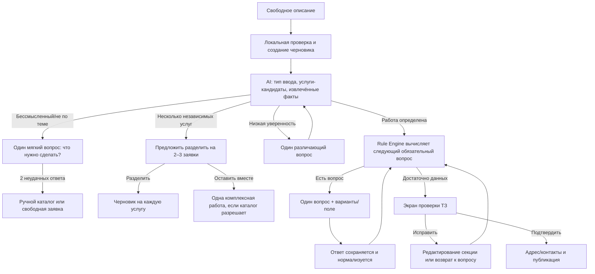
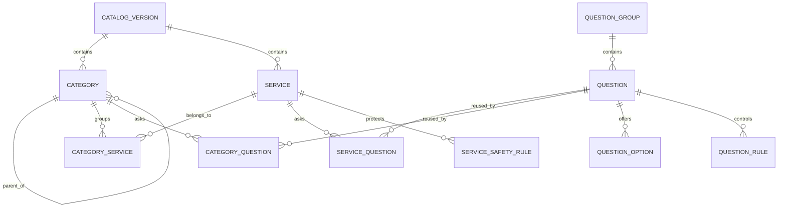

# Treabo.ru — AI-помощник создания заявок

Статус: проект ТЗ для согласования  
Версия: 1.0  
Дата: 30 июля 2026  
Область: `pixer-api`, `shop`, `admin`  
Ограничение этапа: документирование и проектирование; прикладной код не изменяется до согласования.

Связанный контур накопления терминов, импорта Wordstat, обучающих примеров и обратной связи описан отдельно в `docs/AI_KNOWLEDGE_LAB_TZ.md`. Request Assistant использует только опубликованную версию знаний из этого контура; лаборатория не изменяет активный диалог напрямую.

## 1. Цель и границы

### 1.1. Цель

Заменить длинный пошаговый визард коротким управляемым диалогом. Пользователь описывает бытовую или профессиональную задачу свободным текстом, а система:

1. определяет, является ли ввод реальной заявкой;
2. выделяет одну или несколько услуг;
3. выбирает только существующие категорию и работу;
4. извлекает уже названные факты;
5. задаёт по одному только необходимому вопросу;
6. применяет детерминированные условия справочника;
7. формирует проверяемое техническое задание;
8. публикует заявку только после явного подтверждения пользователя.

### 1.2. Продуктовые принципы

- AI интерпретирует язык, но каталог, допустимые значения, обязательность и переходы определяет backend.
- Один диалог создаёт один черновик. Несколько независимых услуг предлагается разделить на несколько черновиков.
- Пользователь всегда видит, что поняла система, и может исправить результат.
- Неизвестное значение хранится как `null`, а не угадывается.
- Вопрос задаётся только тогда, когда ответ влияет на выбор работы, объём, безопасность, цену, подготовку мастера или возможность выполнения.
- Ручной режим — полноценный безопасный маршрут, а не экран ошибки.
- Целевой лимит: не более 4 AI-вызовов в обычном сценарии, жёсткий максимум 6; стоимость p95 завершённой заявки не выше $0.10.

### 1.3. Не входит в первую поставку

- свободное создание AI новых категорий, работ, вопросов или вариантов;
- автоматическая публикация без подтверждения;
- оценка окончательной цены AI;
- замена справочника вероятностной RAG-классификацией;
- распознавание содержимого фотографий в MVP;
- объединение нескольких несвязанных услуг в одну заявку.

## 2. Результаты аудита текущей реализации

### 2.1. API (`pixer-api`)

- Laravel endpoint `POST /proffi/ai/job-draft` принимает `text`, `city_hint`, `category_hint`, `language_hint`.
- `JobDraftAiService` вызывает `POST /v1/responses`, использует `text.format.type=json_schema`, `strict=true`, `max_output_tokens=900`.
- В каждый запрос передаются все активные категории, все работы и вопросы всех работ. Это увеличивает входной контекст и стоимость пропорционально каталогу.
- После ответа backend повторно валидирует `category_id` и `work_id`, затем эвристически переопределяет работу по словам и алиасам.
- Если работа определена, backend возвращает все её активные вопросы независимо от уже извлечённых ответов и без условных переходов.
- Логи `ai_job_drafts` содержат исходный текст, payload, результат, модель, общий `tokens_used` и ошибку. Нет раздельных input/cached/output tokens, стоимости, latency, prompt/catalog version, response ID и оценки качества.
- Ограничение — 12 успешных AI-вызовов в сутки на IP. Нет лимита на диалог/черновик, idempotency key и блокировки параллельных запросов.
- Диалог как серверная сущность отсутствует. Каждый follow-up повторно отправляет склеенный текст.
- В `proffi_tasks.ai_details` сохраняется нестрогое JSON-поле.
- Категория имеет строковый ID и `parent_id`; работа имеет числовой ID и одну nullable-категорию.
- Вопрос принадлежит ровно одной работе, варианты хранятся JSON-массивом строк.
- Справочник из seed-файла на момент аудита содержит 12 работ и 45 вопросов.

### 2.2. Shop

- `RequestWizard.tsx` остаётся шаговым интерфейсом: описание → категория/работа → вопросы → детали → адрес → бюджет → фото → контакты.
- AI-диалог встроен в первый шаг. На каждом ответе заново вызывается тот же endpoint с исходным текстом и обрезанным transcript.
- Максимум уточнений на UI — 6 пользовательских сообщений.
- Уверенность `>=0.65` считается достаточной одновременно и для категории, и для работы.
- После распознавания вопросов всё равно показывается отдельный групповой шаг, а не один вопрос в диалоге.
- Черновик записывается в `localStorage` только после появления `draft.id`; явного восстановления найденного черновика и серверной синхронизации нет.
- Геолокация города запрашивается напрямую у стороннего `ipapi.co`.
- Ручное исправление категории/работы возможно, но влияет на динамический набор шагов и может быть неочевидно пользователю.

### 2.3. Admin

- Есть отдельные CRUD-экраны категорий, работ и вопросов.
- Вопросы поддерживают типы `text`, `textarea`, `number`, `yesno`, `select`, `multiselect`, `photo`.
- Нет групп, нормализованных вариантов, правил показа, ветвлений, предпросмотра, версий и публикации.
- Раздел AI-знаний хранит записи типов `category`, `work`, `parameter`, `question`, `instruction`, однако сервис фактически добавляет к system prompt только активные `instruction`.
- Нет тестовой лаборатории, набора эталонных запросов, аналитики нераспознанных заявок и стоимости.

### 2.4. Риски текущей схемы

1. AI и frontend одновременно управляют сценарием, поэтому логика расходится.
2. Полный каталог в каждом запросе перестанет масштабироваться.
3. Общий confidence скрывает разницу между уверенностью в типе ввода, категории, работе и отдельных фактах.
4. Эвристика backend может молча заменить корректный выбор модели.
5. Все вопросы выбранной работы задаются повторно, даже если ответы есть в исходном тексте.
6. JSON-варианты нельзя стабильно ссылать в условиях и аналитике.
7. Нет воспроизводимости: результат нельзя связать с версией каталога и промпта.
8. IP rate limit создаёт ложные блокировки за NAT и не защищает от повторного клика.
9. Локальный черновик нельзя надёжно восстановить на другом устройстве или после очистки браузера.
10. Default модели в коде — `gpt-5.6-luna`, тогда как целевая модель по постановке — `gpt-4.1-mini`; production значение `OPENAI_MODEL` необходимо проверить отдельно.

## 3. Целевой пользовательский сценарий

### 3.1. Первый экран

Заголовок: «Что нужно сделать?»  
Подзаголовок: «Опишите своими словами — можно коротко и с ошибками».  
Большое поле ввода с примерами:

- «Течёт бачок унитаза, воду перекрыл»
- «Нужно повесить 3 светильника в новой квартире»
- «Убрать двухкомнатную после ремонта»

Действия:

- основное: «Продолжить»;
- вторичное: «Выбрать услугу вручную»;
- прикрепить фото — доступно сразу, но необязательно;
- подсказка о приватности адреса.

Требования:

- минимальный ввод для отправки — 2 видимых символа; бессмысленность определяет не длина, а классификатор;
- Enter отправляет, Shift+Enter переносит строку;
- во время запроса поле не блокируется полностью: текст сохраняется, повторная отправка дедуплицируется;
- первые полезные признаки результата показываются не позднее 2.5 секунды p50 и 6 секунд p95 либо показывается спокойный loading state.

### 3.2. Карта сценария



### 3.3. Реакция на типы ввода

| Ввод | Реакция |
|---|---|
| Короткий, но предметный: «течет кран» | Выбрать кандидатов, извлечь объект/проблему, спросить только критичное: где течёт или можно ли перекрыть воду — согласно правилам работы. |
| С ошибками: «нужен електик розетка искрит» | Нормализовать смысл, не исправлять пользователя публично, выбрать электротехническую работу, задать вопрос безопасности. |
| Неполный: «нужен мастер» | Не угадывать категорию; спросить «Что нужно сделать или что сломалось?». |
| Бессмысленный: «ываыва 123» | Первый раз — дружелюбный пример ожидаемого описания; второй раз — ручной каталог; не тратить больше 2 AI-вызовов. |
| Не услуга: «какая погода?» | Сообщить назначение помощника и предложить описать нужную работу. |
| Несколько связанных действий: «снять старый и поставить новый унитаз» | Одна работа «замена унитаза», действия — в структурированных ответах. |
| Несколько независимых услуг: «починить кран и перевезти диван» | Показать две распознанные карточки и предложить создать две заявки. |
| Опасность: «пахнет газом», «искрит щиток», «сильная протечка» | Сначала фиксированное предупреждение безопасности из каталога; затем вопрос только если безопасно продолжать. AI не генерирует экстренные инструкции сам. |

### 3.4. Когда задавать уточнение

Вопрос задаётся, если одновременно выполняются условия:

- ответ ещё не известен;
- правило показа активно;
- вопрос обязателен либо имеет высокий `information_gain`;
- ответ влияет на работу, безопасность, оценку объёма или подготовку;
- лимит вопросов не исчерпан.

Порядок приоритета:

1. безопасность;
2. различение категории/работы;
3. обязательные блокирующие поля;
4. объём и ключевые технические параметры;
5. материалы и доступ;
6. необязательные пожелания.

Не задавать:

- уже отвеченный вопрос;
- вопрос, чей ответ уверенно извлечён из текста и показан пользователю;
- скрытый условиями вопрос;
- необязательный вопрос после достижения достаточности;
- вопрос об адресе/контактах до сформированного ТЗ, кроме города для доступности услуги.

### 3.5. Ручной выбор

Показывается:

- по явной кнопке с первого экрана;
- после двух нерелевантных/бессмысленных ответов;
- если category confidence < 0.55 после одного различающего вопроса;
- если work confidence < 0.65 после двух различающих вопросов;
- при AI/API timeout или исчерпанном лимите;
- если каталог не содержит подходящей работы.

Ручной маршрут:

1. поиск по каталогу;
2. популярные категории;
3. категория → работа;
4. «Не нашёл подходящую услугу» → заявка `unclassified`, исходный текст сохраняется для модерации.

### 3.6. Прогресс

Не использовать ложные проценты, зависящие от динамического дерева. Показывать четыре смысловых состояния:

1. «Понимаем задачу»;
2. «Уточняем детали» — `получено X из Y обязательных`;
3. «Проверка заявки»;
4. «Контакты и публикация».

`Y` пересчитывается rule engine после каждого ответа. На мобильном — тонкая полоса и короткая подпись; на desktop — компактный checklist.

### 3.7. Исправление результата

На экране проверки:

- категория и работа — кликабельные chips «Изменить»;
- описание, адрес, срок, бюджет, материалы и пожелания — отдельные редактируемые секции;
- структурированные ответы — список «вопрос → ответ»;
- у каждого AI-извлечённого факта есть признак «Распознано из описания»;
- изменение категории или работы предупреждает, какие несовместимые ответы будут архивированы;
- история исправлений сохраняется как события, а не стирается.

### 3.8. Мобильная версия

- один основной вопрос на экран;
- ответы-варианты — крупные кнопки не менее 44 px;
- sticky composer и основное действие над safe area;
- клавиатура не перекрывает вопрос и CTA;
- фото можно снять камерой, прогресс загрузки виден отдельно;
- back возвращает к предыдущему вопросу без потери данных;
- при offline ответы сохраняются локально и синхронизируются после восстановления связи;
- summary открывается bottom sheet, чтобы пользователь в любой момент видел собранное.

## 4. Целевая модель каталога

### 4.1. Решение о подкатегориях

Отдельная сущность `subcategory` не нужна. Категория должна поддерживать иерархию через `parent_id`, но для MVP глубина ограничивается двумя уровнями:

- уровень 1 — глобальное направление;
- уровень 2 — навигационная группа, только если в направлении более 12–15 работ или термины пользователей естественно образуют устойчивые группы.

AI классифицирует в работу, а категория выводится из связей работы. Подкатегория не должна быть обязательной целью AI.

### 4.2. Основные сущности

#### `catalog_versions`

- `id`
- `version`
- `status`: `draft|published|archived`
- `based_on_version_id`
- `published_at`, `published_by`
- `checksum`
- timestamps

#### `service_categories`

- `id` UUID/ULID или сохранённый стабильный string ID
- `catalog_version_id`
- `parent_id`
- `slug`, `name_ru`, `description`
- `aliases_json`
- `sort_order`
- `is_active`
- `manual_selectable`

#### `services` (текущие работы)

- `id` bigint, стабильный между версиями через `stable_key`
- `catalog_version_id`
- `stable_key`
- `slug`, `title`, `description`
- `aliases_json`, `negative_aliases_json`
- `is_complex`
- `allow_multi_intent_merge`
- `manual_selectable`
- `is_active`, `sort_order`

Работа может принадлежать нескольким категориям через связь, но одна связь отмечается primary.

#### `category_service`

- `category_id`
- `service_id`
- `is_primary`
- `sort_order`

#### `question_groups`

- `id`, `catalog_version_id`
- `stable_key`, `title`, `description`
- `scope`: `global|category|service`
- `presentation`: `dialog|review_only`
- `sort_order`, `is_active`

Примеры: «Что случилось», «Объём», «Материалы», «Доступ и безопасность».

#### `questions`

- `id`, `catalog_version_id`
- `stable_key`
- `group_id`
- `label` — канонический вопрос
- `ai_rephrase_instruction` — допустимый стиль перефразирования
- `field_type`: `short_text|long_text|integer|decimal|boolean|single_select|multi_select|date|datetime|money|address|photo|measurement`
- `value_type`: `string|integer|decimal|boolean|date|object|array`
- `unit`
- `placeholder`, `help_text`
- `required_policy`: `always|conditional|recommended|optional`
- `importance`: `safety|routing|scope|pricing|preparation|nice_to_have`
- `validation_json`
- `default_value_json`
- `allow_ai_extract`
- `allow_unknown`
- `sort_order`, `is_active`

#### `question_options`

- `id`, `question_id`
- `stable_key`
- `label`
- `value` — стабильное машинное значение
- `aliases_json`
- `help_text`
- `sort_order`, `is_active`

Условия ссылаются на `option.stable_key`/`value`, а не на отображаемую строку.

#### `service_questions`

- `service_id`
- `question_id`
- `group_id`
- `required_policy_override`
- `sort_order`
- `ask_priority`
- `stop_after_answer`

Это позволяет переиспользовать вопрос между работами без копирования.

#### `category_questions`

Аналогичная связь для общих вопросов категории. Глобальные поля (город, адрес, срок, бюджет, фото) подключаются политикой сценария, а не копируются в каждую работу.

#### `question_rules`

- `id`, `catalog_version_id`
- `scope_type`, `scope_id`
- `name`
- `priority`
- `condition_json`
- `actions_json`
- `is_active`

#### `service_safety_rules`

- `id`, `service_id`
- `trigger_terms_json`
- `condition_json`
- `message`
- `severity`: `warning|urgent`
- `requires_acknowledgement`

Тексты утверждаются редактором; AI может выбрать правило, но не сочинять инструкцию.

### 4.3. Связи



## 5. Условная логика вопросов

### 5.1. Принцип

Условия исполняет backend rule engine. AI только:

- извлекает возможные ответы;
- выбирает кандидатов каталога;
- перефразирует уже выбранный backend вопрос;
- не определяет обязательность и следующий переход.

### 5.2. Формат условия

Использовать ограниченный JSON Logic-подобный DSL, валидируемый JSON Schema. Разрешённые операторы:

- `all`, `any`, `not`;
- `eq`, `neq`, `in`, `contains`;
- `gt`, `gte`, `lt`, `lte`;
- `exists`, `answered`;
- `service_is`, `category_is`.

Пример ветки:

```json
{
  "all": [
    {"eq": [{"answer": "request_type"}, "repair"]},
    {"eq": [{"answer": "fixture"}, "toilet"]},
    {"eq": [{"answer": "fault_type"}, "leak"]}
  ]
}
```

Действия:

```json
{
  "show": ["leak_source", "water_shutoff_possible"],
  "require": ["water_shutoff_possible"],
  "hide": ["installation_model"],
  "set_safety_message": "water_leak_shutdown",
  "mark_complete": false
}
```

### 5.3. Полный пример сантехники

```json
[
  {
    "name": "Тип задачи",
    "condition": {"exists": {"service": true}},
    "actions": {"show": ["request_type"], "require": ["request_type"]}
  },
  {
    "name": "Ремонт",
    "condition": {"eq": [{"answer": "request_type"}, "repair"]},
    "actions": {"show": ["fixture", "fault_type"], "require": ["fixture"]}
  },
  {
    "name": "Унитаз",
    "condition": {"eq": [{"answer": "fixture"}, "toilet"]},
    "actions": {"show": ["toilet_part"], "require": ["toilet_part"]}
  },
  {
    "name": "Протечка",
    "condition": {"eq": [{"answer": "fault_type"}, "leak"]},
    "actions": {
      "show": ["leak_source", "water_shutoff_possible"],
      "require": ["leak_source", "water_shutoff_possible"],
      "set_safety_message": "water_leak_shutdown"
    }
  }
]
```

### 5.4. Выбор следующего вопроса

Rule engine:

1. строит активный набор вопросов;
2. исключает отвеченные и скрытые;
3. отмечает обязательность;
4. сортирует по `importance`, `ask_priority`, `sort_order`;
5. выбирает один вопрос;
6. проверяет лимит;
7. возвращает канонический вопрос и допустимые ответы AI-слою.

AI может изменить только фразу, не `question_id`, `field_type`, options или validation.

### 5.5. Проверки правил при публикации

- отсутствуют ссылки на удалённые сущности;
- нет недостижимых обязательных вопросов;
- нет циклов, которые требуют повторного ответа;
- значения условий совместимы с типом вопроса;
- у select-вопроса значение существует;
- для каждого активного сервиса существует путь к `ready_for_review`;
- safety-вопросы нельзя скрыть правилом меньшего приоритета.

## 6. Архитектура AI-диалога

### 6.1. Разделение ответственности

| Компонент | Ответственность |
|---|---|
| Shop | Отображение, локальный optimistic state, ввод, исправления, offline cache |
| Dialogue Orchestrator в API | Состояние, лимиты, выбор операции, idempotency, сбор результата |
| Catalog Candidate Selector | Сужение каталога до кандидатов |
| OpenAI Responses API | intent, извлечение фактов, ранжирование кандидатов, естественная фраза |
| Rule Engine | Условия, обязательность, следующий вопрос, достаточность |
| Validator | Проверка ID, типов, options, диапазонов, конфликтов |
| Draft Builder | Каноническое ТЗ и summary |
| Analytics | стоимость, latency, качество, воронка |

### 6.2. Состояния диалога

`new → classifying → clarifying → ready_for_review → awaiting_contact → publishing → published`

Дополнительные:

- `manual_selection`
- `split_intents`
- `paused`
- `expired`
- `failed_recoverable`
- `abandoned`

Переходы выполняются только backend-командой и записываются в event log.

### 6.3. Алгоритм одного хода

1. принять `draft_id`, сообщение/ответ, `client_turn_id`, `draft_version`;
2. дедуплицировать по `(draft_id, client_turn_id)`;
3. применить optimistic concurrency;
4. сохранить пользовательское сообщение;
5. если это ответ на structured question — валидировать без AI;
6. запустить rule engine;
7. если следующего вопроса достаточно выбрать детерминированно — AI-вызов не нужен;
8. вызвать AI только для новой свободной фразы, неоднозначной классификации или извлечения нескольких фактов;
9. провалидировать AI JSON против опубликованного каталога;
10. слить новые факты, не перезаписывая подтверждённые пользователем;
11. снова запустить rule engine;
12. вернуть одно действие UI: вопрос, split, manual fallback, safety notice или review.

### 6.4. Политика доверия к фактам

Для каждого значения хранить:

- `source`: `user_explicit|user_selected|ai_extracted|system_default|admin_rule`;
- `confidence`;
- `evidence_message_id`;
- `confirmed_at`;
- `catalog_version_id`.

Приоритет:

`user_selected > user_explicit > admin_rule > ai_extracted > system_default`.

AI не может менять подтверждённое значение без явного конфликта. При конфликте задаётся простой вопрос выбора.

### 6.5. Ограничения уточнений

- обычная цель: 2–4 вопроса;
- soft limit: 5 вопросов;
- hard limit: 6 AI-assisted turns;
- не более 2 вопросов на различение работы;
- не более 2 попыток после бессмысленного ввода;
- optional вопросы после soft limit пропускаются;
- safety и критически обязательные поля могут быть показаны детерминированно сверх soft limit, но не требуют отдельного AI-вызова.

### 6.6. Несколько услуг

AI возвращает `intents[]` до 3 элементов. Backend группирует:

- один service + связанные действия → один intent;
- разные services с `allow_multi_intent_merge=false` → split;
- неизвестные элементы остаются отдельным `unclassified` intent.

UI спрашивает: «Похоже, здесь две задачи. Создать две заявки?» и показывает редактируемые карточки. Исходное сообщение связывается со всеми дочерними черновиками.

### 6.7. Бессмысленный ввод

`input_class`:

- `service_request`
- `greeting`
- `gibberish`
- `unrelated`
- `unsafe_or_emergency`
- `insufficient`

Для `greeting/gibberish/unrelated` category/work обязаны быть `null`. Backend отклоняет противоречащий ответ модели. После двух неуспешных ходов — ручной режим без нового AI-вызова.

### 6.8. Контекст Responses API

Источник истины — собственная БД Treabo. `previous_response_id` допустим как оптимизация только внутри короткой активной сессии, но:

- каждый ход всё равно связан с локальными сообщениями и snapshot;
- инструкции и prompt version передаются явно;
- после timeout/retention диалог восстанавливается из компактного server-side snapshot;
- персональные адресные данные не должны без необходимости попадать в prompt;
- параметр хранения OpenAI выбирается после юридического решения по data retention.

## 7. Строгий результат AI

AI не должен генерировать финальный объект публикации напрямую. Он возвращает `DialogueInference`; backend строит `RequestDraft`.

### 7.1. `DialogueInference` — Structured Output

```json
{
  "$schema": "https://json-schema.org/draft/2020-12/schema",
  "title": "TreaboDialogueInference",
  "type": "object",
  "additionalProperties": false,
  "required": [
    "input_class",
    "intents",
    "extracted_facts",
    "conflicts",
    "assistant_text",
    "confidence"
  ],
  "properties": {
    "input_class": {
      "type": "string",
      "enum": ["service_request", "greeting", "gibberish", "unrelated", "unsafe_or_emergency", "insufficient"]
    },
    "intents": {
      "type": "array",
      "maxItems": 3,
      "items": {
        "type": "object",
        "additionalProperties": false,
        "required": ["category_id", "service_id", "label", "confidence"],
        "properties": {
          "category_id": {"type": ["string", "null"]},
          "service_id": {"type": ["integer", "null"]},
          "label": {"type": "string", "maxLength": 160},
          "confidence": {"type": "number", "minimum": 0, "maximum": 1}
        }
      }
    },
    "extracted_facts": {
      "type": "array",
      "items": {
        "type": "object",
        "additionalProperties": false,
        "required": ["question_key", "value", "confidence", "evidence"],
        "properties": {
          "question_key": {"type": "string"},
          "value": {},
          "confidence": {"type": "number", "minimum": 0, "maximum": 1},
          "evidence": {"type": "string", "maxLength": 240}
        }
      }
    },
    "conflicts": {
      "type": "array",
      "items": {
        "type": "object",
        "additionalProperties": false,
        "required": ["field_key", "new_value"],
        "properties": {
          "field_key": {"type": "string"},
          "new_value": {}
        }
      }
    },
    "assistant_text": {"type": "string", "maxLength": 300},
    "confidence": {
      "type": "object",
      "additionalProperties": false,
      "required": ["input", "category", "service", "facts"],
      "properties": {
        "input": {"type": "number", "minimum": 0, "maximum": 1},
        "category": {"type": "number", "minimum": 0, "maximum": 1},
        "service": {"type": "number", "minimum": 0, "maximum": 1},
        "facts": {"type": "number", "minimum": 0, "maximum": 1}
      }
    }
  }
}
```

Примечание: в production schema поле `value` задаётся как разрешённый union поддерживаемых типов, совместимый с подмножеством JSON Schema Structured Outputs; пустая схема здесь означает полиморфное значение на уровне продуктового ТЗ.

### 7.2. `RequestDraft` — канонический результат backend

```json
{
  "id": "01J...",
  "status": "ready_for_review",
  "version": 8,
  "catalog_version": "2026.08.1",
  "title": "Устранить протечку бачка унитаза",
  "category": {
    "id": "plumbing",
    "name": "Сантехника"
  },
  "work": {
    "id": 142,
    "stable_key": "toilet_repair",
    "name": "Ремонт унитаза"
  },
  "description": "Протекает бачок унитаза. Воду можно перекрыть.",
  "answers": [
    {
      "question_id": 901,
      "question_key": "fault_type",
      "question": "Что произошло?",
      "value": "leak",
      "display_value": "Протечка",
      "source": "ai_extracted",
      "confidence": 0.96,
      "confirmed": false
    }
  ],
  "location": {
    "city": "Москва",
    "address": null,
    "lat": null,
    "lng": null,
    "access_notes": null
  },
  "urgency": {
    "code": "urgent",
    "desired_at": null,
    "flexible": false
  },
  "budget": {
    "type": "unknown",
    "amount": null,
    "min": null,
    "max": null,
    "currency": "RUB"
  },
  "photos": [
    {
      "upload_id": "upl_...",
      "url": "/files/...",
      "caption": null
    }
  ],
  "materials": {
    "status": "unknown",
    "provided_by": "unknown",
    "notes": null
  },
  "constraints": [],
  "preferences": [],
  "missing": [
    {
      "field_key": "leak_source",
      "reason": "required_by_rule",
      "blocking": true
    }
  ],
  "confidence": {
    "overall": 0.89,
    "category": 0.99,
    "work": 0.91,
    "facts": 0.84
  },
  "master_summary": "Нужен ремонт унитаза: протекает бачок, воду на объекте можно перекрыть.",
  "multiple_services_detected": false,
  "safety_notices": [],
  "created_at": "2026-07-30T12:00:00Z",
  "updated_at": "2026-07-30T12:03:00Z"
}
```

### 7.3. Правила финального результата

- `title` — 5–100 символов, действие + объект, без города и рекламных слов;
- `description` — только известные факты, без внутренних confidence;
- `master_summary` — до 500 символов, профессионально полезное резюме;
- category/work всегда представлены ID и snapshot-названием;
- ответы хранят raw value и display snapshot;
- бюджет не превращается из «примерно 10 тысяч» в fixed без подтверждения;
- фото — ссылки на собственные upload records, не base64;
- `missing` вычисляет backend;
- общий confidence вычисляется backend из компонент и полноты, а не копируется из модели.

## 8. API-контракты

### 8.1. Создать черновик

`POST /proffi/request-drafts`

```json
{
  "initial_text": "Течет бачок, воду перекрыл",
  "city_hint": "Москва",
  "photo_upload_ids": [],
  "client_draft_id": "550e8400-e29b-41d4-a716-446655440000",
  "idempotency_key": "req-start-..."
}
```

Ответ `201`:

```json
{
  "data": {
    "draft": {"id": "01J...", "status": "clarifying", "version": 1},
    "ui_action": {
      "type": "ask_question",
      "question": {
        "id": 901,
        "key": "leak_source",
        "text": "Откуда именно течёт?",
        "field_type": "single_select",
        "options": [
          {"value": "tank", "label": "Из бачка"},
          {"value": "connection", "label": "В месте подключения"},
          {"value": "unknown", "label": "Не знаю"}
        ]
      }
    },
    "progress": {"stage": "clarifying", "answered_required": 2, "active_required": 3}
  }
}
```

### 8.2. Отправить ход

`POST /proffi/request-drafts/{id}/turns`

```json
{
  "client_turn_id": "uuid",
  "expected_version": 1,
  "message": null,
  "answer": {
    "question_id": 901,
    "value": "tank"
  },
  "idempotency_key": "turn-..."
}
```

Ответ возвращает новую `version`, обновлённый snapshot, ровно один `ui_action`.

Типы `ui_action`:

- `ask_question`
- `show_safety_notice`
- `choose_category`
- `choose_service`
- `split_intents`
- `review`
- `manual_fallback`
- `wait`

### 8.3. Исправить поле

`PATCH /proffi/request-drafts/{id}`

```json
{
  "expected_version": 4,
  "changes": [
    {"op": "replace", "path": "/work/id", "value": 145},
    {"op": "replace", "path": "/urgency/code", "value": "this_week"}
  ]
}
```

Разрешён whitelist путей. При смене работы ответ включает `invalidated_answers`.

### 8.4. Получить/восстановить

- `GET /proffi/request-drafts/{id}`
- `GET /proffi/request-drafts/latest?client_draft_id=...`
- для гостя — подписанный recovery token в HttpOnly cookie;
- после авторизации гостевой draft привязывается к user.

### 8.5. Разделить

`POST /proffi/request-drafts/{id}/split`

```json
{
  "intent_indexes": [0, 1],
  "idempotency_key": "split-..."
}
```

### 8.6. Подтвердить и опубликовать

`POST /proffi/request-drafts/{id}/confirm`

```json
{
  "expected_version": 8,
  "consent": true,
  "idempotency_key": "publish-..."
}
```

Backend повторно валидирует published catalog version, обязательные ответы, контакты и адрес. Повтор с тем же ключом возвращает тот же `task_id`.

### 8.7. Ошибки

Единый формат:

```json
{
  "error": {
    "code": "DRAFT_VERSION_CONFLICT",
    "message": "Черновик был обновлён в другой вкладке.",
    "retryable": true,
    "details": {},
    "request_id": "req_..."
  }
}
```

Ключевые коды: `INVALID_ANSWER`, `CATALOG_VERSION_EXPIRED`, `AI_UNAVAILABLE`, `AI_BUDGET_EXCEEDED`, `RATE_LIMITED`, `DRAFT_EXPIRED`, `DRAFT_VERSION_CONFLICT`, `PUBLISH_VALIDATION_FAILED`.

## 9. Хранение состояния

### 9.1. Таблицы runtime

#### `request_drafts`

- `id` ULID
- `user_id`, `guest_token_hash`
- `parent_draft_id`
- `status`, `version`
- `catalog_version_id`, `prompt_version_id`
- `selected_category_id`, `selected_service_id`
- `input_class`
- `snapshot_json`
- `ai_calls_count`, `questions_asked_count`
- `estimated_cost_usd`
- `expires_at`, `last_activity_at`
- timestamps

#### `request_draft_messages`

- `id`, `draft_id`, `turn_no`
- `role`: `user|assistant|system`
- `content`
- `question_id`
- `client_turn_id`
- `metadata_json`
- timestamps

Уникальный индекс `(draft_id, client_turn_id)`.

#### `request_draft_answers`

- `draft_id`, `question_id`
- `value_json`, `display_value`
- `source`, `confidence`
- `evidence_message_id`
- `is_confirmed`
- `catalog_version_id`
- timestamps

Уникальный `(draft_id, question_id)`.

#### `request_draft_events`

Append-only события: state transition, correction, answer invalidation, split, fallback, publish.

#### `ai_invocations`

- draft/turn/request IDs
- provider, model, endpoint
- prompt version, catalog version
- OpenAI response ID
- status, error code
- input, cached input, output tokens
- calculated cost USD
- latency, retries
- schema name/version
- redacted request/response hashes
- timestamps

### 9.2. Черновики и восстановление

- серверный TTL гостевого черновика: 30 дней;
- локально хранить только `draft_id`, recovery marker, last known version и несинхронизированный ввод;
- чувствительные адрес/контакты не хранить в открытом localStorage;
- при загрузке: получить server snapshot → применить pending local operation → разрешить конфликт по version;
- открытие второй вкладки синхронизировать через `BroadcastChannel`;
- после публикации draft read-only и связан с `proffi_task`.

## 10. OpenAI Responses API и бюджет

### 10.1. Вызовы

Рекомендуемый pipeline:

1. candidate selection без AI: aliases, полнотекстовый/триграммный поиск, популярность;
2. один AI-вызов на классификацию и извлечение фактов по top 5–12 работам;
3. structured ответы пользователя обрабатываются без AI;
4. AI вызывается повторно только при свободном неоднозначном ответе;
5. финальные title/description/summary формирует backend шаблонами; один финальный AI-вызов допускается только если текст требует нормализации.

### 10.2. Prompt и каталог

- стабильные инструкции и schema — в начале prompt для cache hit;
- динамический transcript и кандидаты — в конце;
- не отправлять вопросы всех работ;
- передавать только top candidates, активные вопросы выбранных кандидатов и допустимые option values;
- передавать компактные поля, без help text, который не нужен модели;
- prompt version immutable после публикации;
- production использует snapshot модели, если доступен и прошёл eval.

### 10.3. Structured Outputs

- `text.format.type = json_schema`;
- `strict = true`;
- `additionalProperties = false`;
- все поля required, nullable там, где значение неизвестно;
- schema version сохраняется в invocation;
- refusal/incomplete/timeout обрабатываются отдельно от invalid JSON;
- backend всё равно проверяет IDs и значения против catalog version.

### 10.4. Лимиты

- `max_output_tokens`: 350 для turn inference, 600 для split/complex extraction;
- максимум 6 AI-вызовов на draft, warning после 4;
- budget circuit breaker: $0.06 internal warning, $0.08 hard AI stop, чтобы публикация вместе с возможным retry оставалась ниже $0.10;
- timeout 12 секунд, один retry только для retryable transport/5xx и только с тем же idempotency context;
- exponential backoff с jitter;
- per draft lock 15 секунд;
- rate limit: user + guest token + IP, отдельный лимит start/turn, а не только IP.

### 10.5. Кэширование

- compiled published catalog в Redis по `catalog_version_id`;
- candidate index прогревается при публикации;
- prompt prefix стабилен для provider caching;
- exact AI result не кэшировать по персональному тексту;
- допустим semantic cache только для candidate shortlist без персональных данных;
- справочник на frontend отдаётся с ETag и stale-while-revalidate.

### 10.6. Стоимость

Для `gpt-4.1-mini` на 30.07.2026 официальная цена:

- input: $0.40 / 1M tokens;
- cached input: $0.10 / 1M tokens;
- output: $1.60 / 1M tokens.

Формула:

`cost = uncached_input / 1M × 0.40 + cached_input / 1M × 0.10 + output / 1M × 1.60`

Целевой сценарий после сужения каталога:

| Сценарий | Вызовы | Input | Cached input | Output | Стоимость заявки | 1 000 заявок |
|---|---:|---:|---:|---:|---:|---:|
| Типичный | 3 | 6 000 | 3 000 | 750 | $0.0039 | $3.90 |
| p95 сложный | 6 | 18 000 | 6 000 | 1 800 | $0.0095 | $9.48 |
| Без кэша, p95 | 6 | 24 000 | 0 | 1 800 | $0.0125 | $12.48 |
| Жёсткий бюджет | — | — | — | — | ≤ $0.10 | ≤ $100 |

Расчёт typical: `3k×0.40/M + 3k×0.10/M + 750×1.60/M = $0.0027`; при резерве 45% на retries/разброс — около `$0.0039`.

Расчёт p95: `12k×0.40/M + 6k×0.10/M + 1.8k×1.60/M = $0.00828`; с резервом 14.5% — `$0.00948`.

Даже консервативный сценарий существенно ниже $0.10. Главный риск — не цена одного токена, а передача полного растущего каталога на каждом ходе и бесконтрольные retries. Цены должны храниться в конфигурации с датой действия; dashboard считает фактическую стоимость по `usage`, а не по оценке.

## 11. Версионирование промптов и каталога

### 11.1. `ai_prompt_versions`

- `id`, `name`, `version`
- `purpose`: `classify_extract|rephrase|summarize`
- `instructions`
- `schema_json`, `schema_version`
- `model`, `max_output_tokens`
- `status`: `draft|testing|published|retired`
- `evaluation_run_id`
- `published_by`, `published_at`
- checksum, timestamps

### 11.2. Публикация

1. редактор изменяет draft catalog/prompt;
2. backend выполняет structural validation;
3. запускается обязательный regression eval;
4. показывается diff метрик, tokens и стоимости;
5. пользователь с ролью publisher подтверждает;
6. версия становится immutable;
7. Redis/index прогреваются;
8. новые drafts используют новую версию, активные продолжают на зафиксированной версии;
9. rollback — переключение указателя на прошлую опубликованную версию.

## 12. Макеты экранов текстом

### 12.1. Экран A — старт

Desktop: слева заголовок и доверительная подсказка, справа/по центру большая composer-card; под ней три примера и ссылка ручного выбора.  
Mobile: заголовок, textarea на 5–6 строк, attach, sticky «Продолжить».

### 12.2. Экран B — диалог

Верх: краткое «Заявка: ремонт унитаза» и действие «Изменить».  
Центр: последние сообщения, активен только один вопрос.  
Под вопросом: quick replies или подходящее поле.  
Сбоку/в bottom sheet: «Уже поняли» — город, работа, найденные факты.  
Низ: «Не знаю», «Пропустить» только если политика разрешает, «Выбрать вручную».

### 12.3. Экран C — несколько услуг

Текст: «Нашли несколько разных задач».  
Карточки с предполагаемой услугой, частью исходного текста и checkbox.  
CTA «Создать 2 заявки». Вторичное «Оставить одной» доступно только для совместимых работ.

### 12.4. Экран D — ручной каталог

Поиск, популярные направления, категории и работы. Исходное описание закреплено сверху. После выбора AI извлекает факты повторно только если budget позволяет; иначе вопросы идут детерминированно.

### 12.5. Экран E — проверка

Заголовок и категория/работа. Затем карточки:

- описание;
- параметры работы;
- адрес;
- срок и бюджет;
- материалы;
- фото;
- ограничения и пожелания.

У каждой карточки «Изменить». Внизу summary для мастера и CTA «Всё верно, продолжить».

### 12.6. Экран F — контакты и публикация

Авторизация/контакт, согласие, финальный CTA. Не повторять уже введённые данные. При ошибке публикации draft остаётся готовым.

## 13. Требования к админке

### 13.1. Каталог

- дерево категорий с ограничением глубины;
- CRUD работ, aliases и negative aliases;
- многие-ко-многим категория ↔ работа, primary category;
- поиск, фильтры, массовая активация;
- запрет hard delete опубликованных сущностей, только архивирование.

### 13.2. Редактор вопросов

- библиотека переиспользуемых вопросов;
- группы;
- визуальный выбор типа и validation;
- стабильные option values отдельно от labels;
- required policy и importance;
- AI extraction toggle и инструкция перефразирования;
- drag-and-drop порядка.

### 13.3. Визуальный редактор условий

- режим «Если [вопрос] [оператор] [значение], то [действие]»;
- группы AND/OR/NOT;
- визуальный граф и табличный режим;
- подсветка циклов, недостижимых узлов и конфликтов;
- симулятор: администратор вводит ответы и видит следующий вопрос;
- авто-generated человекочитаемое описание правила;
- JSON доступен только экспертной роли.

### 13.4. Предпросмотр

- desktop/mobile preview;
- выбор работы и стартового текста;
- прохождение полного сценария без production-вызовов;
- отображение active/hidden/required вопросов и сработавших правил.

### 13.5. AI Lab

- текстовый запрос → кандидаты → извлечённые факты → результат;
- сравнение текущей и draft версии;
- показ input/cached/output tokens, цены, latency, raw structured output;
- сохранение примера в regression dataset;
- batch run по тестовому набору;
- redaction персональных данных.

### 13.6. Инструкции AI

Вместо произвольных разрозненных knowledge rows:

- глобальные инструкции;
- инструкции категории/работы;
- safety messages отдельно;
- prompt diff, version, author;
- validation длины и конфликтующих правил;
- нельзя публиковать без eval.

### 13.7. Аналитика

Dashboard:

- input classes;
- top unrecognized texts с PII masking;
- confusion pairs category/work;
- manual corrections;
- mean/p50/p95 AI calls, questions, latency, cost;
- completion funnel;
- split-intent rate;
- fallback and error rate;
- каталог без покрывающих тестов.

### 13.8. Роли

- `catalog_editor`
- `ai_editor`
- `analyst`
- `publisher`
- `admin`

Изменение и публикация разделены. Все действия журналируются.

## 14. Контроль качества

### 14.1. Тестовый набор

Минимум 500 обезличенных примеров перед production:

- 150 типичных;
- 75 коротких;
- 75 с ошибками/разговорной речью;
- 50 неоднозначных;
- 50 multi-intent;
- 40 бессмысленных/не по теме;
- 30 safety;
- 30 редких услуг;
- 50 с уже данными ответами на вопросы.

Каждый пример содержит:

- expected input class;
- допустимые category/service IDs;
- expected extracted facts;
- вопросы, которые нельзя задавать;
- допустимый следующий вопрос;
- максимальное число ходов;
- критерий готовности.

### 14.2. Автоматические проверки

- schema validity = 100%;
- invalid catalog ID после backend validation = 0%;
- несуществующее option value = 0%;
- повтор уже отвеченного вопроса < 0.5%;
- critical safety rule recall ≥ 99%;
- category top-1 accuracy ≥ 92%, top-3 ≥ 98%;
- service top-1 accuracy ≥ 85%, top-3 ≥ 95%;
- gibberish/unrelated precision ≥ 95%, recall ≥ 95%;
- multi-intent F1 ≥ 90%.

### 14.3. Продуктовые метрики

- completion rate от созданного draft ≥ 65% в MVP, цель ≥ 75%;
- median вопросов ≤ 3, p90 ≤ 5;
- manual category/work correction ≤ 15%, затем цель ≤ 8%;
- manual fallback ≤ 10%;
- p95 AI cost ≤ $0.02, hard maximum $0.10;
- p95 turn latency ≤ 6 сек;
- доля опубликованных заявок с достаточным ТЗ по оценке мастеров ≥ 80%;
- рост completion vs текущий wizard — минимум +10% относительный в A/B.

### 14.4. Human review

Еженедельно выборка:

- 100 завершённых;
- 50 брошенных;
- все expensive outliers;
- все safety;
- 50 ручных исправлений.

Оценки: корректность маршрута, полезность summary, лишние вопросы, выдуманные факты, безопасность.

## 15. Миграция текущих данных

### 15.1. Подготовка

1. выгрузить production категории, работы, вопросы и usage;
2. найти дубли slug/field_key, пустые категории, orphan works;
3. зафиксировать mapping старых ID в stable keys;
4. создать catalog version `legacy-import-v1`.

### 15.2. Категории

- `proffi_categories` переносятся с теми же строковыми ID;
- `parent_id` сохраняется;
- глубина >2 отмечается для ручного решения;
- aliases дополняются из AI knowledge только после модерации.

### 15.3. Работы

- `proffi_works.id` сохраняется;
- `title`, `slug`, aliases, description переносятся;
- текущая `category_id` создаёт primary `category_service`;
- nullable category требует ручного назначения или архивирования;
- автоматически создать `stable_key`, затем утвердить.

### 15.4. Вопросы

- каждую старую запись сначала переносить как отдельный question со stable key;
- `options`-строки преобразовать в `question_options` с нормализованным value;
- `is_required=true` → `required_policy=always`;
- types маппируются:
  - `text` → `short_text`;
  - `textarea` → `long_text`;
  - `number` → `decimal`/`integer` после проверки unit;
  - `yesno` → `boolean`;
  - `select` → `single_select`;
  - `multiselect` → `multi_select`;
  - `photo` → `photo`;
- вопросы с одинаковым смыслом сначала не объединять автоматически; выдать отчёт кандидатов на merge;
- все вопросы по умолчанию остаются без условий, затем ветвления настраиваются редактором.

### 15.5. Старые заявки

- `proffi_tasks` не переписывать;
- `ai_details` сохранить;
- новые заявки получают `request_draft_id`, catalog/prompt version и нормализованные answer records;
- API чтения поддерживает legacy `ai_details` и новый формат через adapter.

### 15.6. Переход без простоя

1. добавить новые таблицы;
2. dual-read каталог;
3. импортировать и сверить counts/checksum;
4. shadow mode нового orchestrator;
5. включить feature flag для сотрудников;
6. 5% пользователей;
7. 25% → 50% → 100% при соблюдении guardrails;
8. старый wizard оставить rollback-маршрутом минимум на 2 релиза.

## 16. План внедрения и критерии приёмки

### Этап 0. Подготовка и baseline — 1–2 недели

- production inventory;
- baseline funnel, cost, accuracy;
- 200+ размеченных тестов;
- подтверждение модели и цен;
- согласование PII/data retention.

Приёмка: baseline dashboard и dataset утверждены, ID mapping не имеет конфликтов.

### Этап 1. MVP AI-помощника — 3–5 недель

- server-side drafts/messages/answers;
- candidate shortlist;
- один вопрос за ход;
- строгий inference JSON;
- review screen и ручной fallback;
- idempotency, restore, cost logging;
- без условных веток, кроме обязательности и линейного порядка.

Приёмка:

- end-to-end 50 эталонных сценариев;
- schema 100%, invalid IDs 0%;
- восстановление после закрытия;
- max 6 AI calls;
- p95 cost < $0.02;
- публикация только после confirm.

### Этап 2. Улучшенный AI-диалог — 2–4 недели

- multi-intent;
- отдельные confidence;
- conflicts/evidence;
- свободные follow-ups;
- safety notices;
- A/B со старым wizard.

Приёмка: target метрики классификации и multi-intent; нет пропуска critical safety в тестах.

### Этап 3. Условные вопросы — 3–4 недели

- groups/options normalization;
- JSON rule DSL и engine;
- simulator/validator;
- миграция ключевых 20% работ, покрывающих 80% заявок.

Приёмка: все опубликованные графы без циклов/недостижимых required; 100% branch tests для мигрированных работ.

### Этап 4. Визуальный редактор — 3–5 недель

- no-code builder;
- preview mobile/desktop;
- version/diff/publish/rollback;
- роли и audit log.

Приёмка: контент-менеджер создаёт ветку примера без разработчика; draft не влияет на production до publish.

### Этап 5. Аналитика и оптимизация — 2–4 недели, затем постоянно

- AI Lab, batch eval;
- quality/cost dashboards;
- unrecognized clusters;
- prompt/catalog experiments;
- caching and outlier alerts.

Приёмка: каждая invocation имеет cost/version/latency; regression gate блокирует ухудшающую публикацию.

## 17. Нефункциональные требования

- API availability без OpenAI: ручной сценарий остаётся доступен.
- p95 обычного не-AI turn < 500 мс.
- optimistic concurrency и идемпотентность обязательны.
- PII masking в логах; raw address/phone не отправлять в eval.
- шифрование транспортом и стандартное шифрование БД/backup.
- retention raw AI payload ограничивается политикой; агрегаты хранятся дольше.
- accessibility: keyboard navigation, labels, focus, contrast WCAG AA.
- observability: request ID сквозь shop → API → OpenAI invocation.
- feature flags и kill switch для AI без релиза frontend.

## 18. Решения, требующие согласования

До программирования необходимо утвердить:

1. Один draft всегда равен одной независимой услуге; multi-intent по умолчанию разделяется.
2. Подкатегория реализуется иерархией категорий, отдельной таблицы нет.
3. Rule engine — единственный источник порядка и обязательности вопросов.
4. AI не создаёт IDs/options и не решает публикацию.
5. Целевые пороги: category 0.55 для уточнения, service 0.65; затем калибруются eval.
6. Soft/hard limits: 5 вопросов / 6 AI-вызовов.
7. `gpt-4.1-mini` остаётся целевой production-моделью либо проводится отдельный сравнительный eval с текущим default `gpt-5.6-luna`.
8. Хранение Responses API state и PII-политика согласуются с юридическими требованиями; Treabo DB остаётся source of truth.
9. Старый wizard сохраняется как rollback на два релиза.
10. MVP включает серверное восстановление и idempotency, поскольку без них диалог нельзя считать production-ready.

## 19. Definition of Done всей программы

- пользователь может создать заявку свободным текстом, ответив в типичном случае не более чем на 3 вопроса;
- система корректно обрабатывает ошибки, мусор, неоднозначность и несколько услуг;
- каждый выбранный ID и option существует в зафиксированной версии каталога;
- условные переходы настраиваются и тестируются без кода;
- пользователь видит и исправляет все существенные выводы;
- диалог восстанавливается после закрытия страницы;
- AI недоступен — ручной маршрут работает;
- стоимость каждой заявки измеряется, p95 ниже $0.02, hard guardrail $0.10;
- каталог и промпты версионируются, тестируются, публикуются и откатываются;
- качество подтверждено regression dataset и продуктовым A/B тестом.

## 20. Источники и проверяемые точки реализации

Локальная реализация:

- `pixer-api/app/Services/Ai/JobDraftAiService.php`
- `pixer-api/app/Http/Controllers/Api/AiJobDraftController.php`
- `pixer-api/database/migrations/2026_06_08_000001_create_ai_job_drafts_table.php`
- `pixer-api/database/migrations/2026_07_02_000001_create_proffi_works_and_questions_tables.php`
- `pixer-api/database/migrations/2026_07_02_000002_add_ai_details_to_proffi_tasks.php`
- `shop/src/components/treabo-request/RequestWizard.tsx`
- `shop/src/lib/treabo/request-wizard.ts`
- `admin/src/pages/proffi/works.tsx`
- `admin/src/pages/proffi/questions.tsx`
- `admin/src/pages/proffi/ai-chat.tsx`

Официальная документация OpenAI, проверенная 30.07.2026:

- [GPT-4.1 mini](https://developers.openai.com/api/docs/models/gpt-4.1-mini): pricing, Responses, Structured Outputs.
- [Responses API reference](https://platform.openai.com/docs/api-reference/responses): `previous_response_id`, conversation state, `prompt_cache_key`.
- [Structured Outputs](https://platform.openai.com/docs/guides/structured-outputs): `json_schema`, `strict=true`, ограниченное подмножество JSON Schema.
- [Data controls](https://platform.openai.com/docs/models/default-usage-policies-by-endpoint): retention Responses API необходимо учитывать при выборе `store` и архитектуры восстановления.
